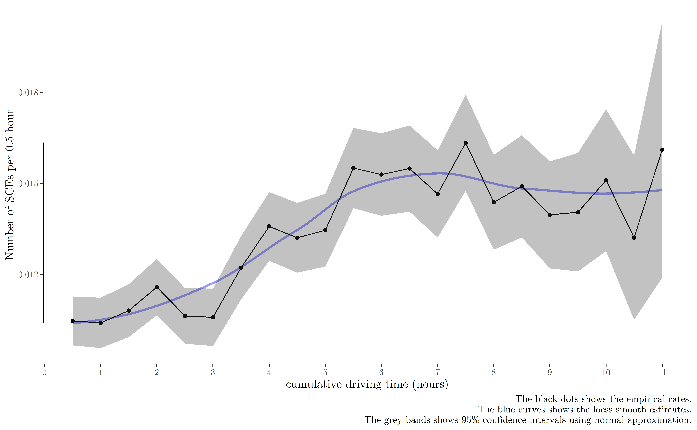

\newcommand{\blandscape}{\begin{landscape}}
\newcommand{\elandscape}{\end{landscape}}
\setlength\footskip{1.8cm}
\doublespacing

```{r setup, include=FALSE}
knitr::opts_chunk$set(echo = FALSE, message=FALSE, fig.align = "center", 
                      out.width='\\textwidth', fig.pos = 'H')
```


Introduction {#intro}
============
The World Health Organization [@who2018] estimated that road injury claimed around 1.4 million lives globally in 2016, which was the eighth leading cause of death. Among all types of vehicles on road, large trucks are a concern since they are more frequently involved in catastrophic crashes. In the United States, @nhtsa2017 reported that 4.3% of registered vehicles were large trucks or buses, but they account for 12.4% of vehicle-related fatalities [@hickman2018synthetic]. Truck drivers are often on the road for long routes under on-time demands, complex traffic and weather conditions, with little to no supervision and contact with fellow workers. Therefore, trucking safety is an important research topic and a number of studies have been published to predict and reduce crash risk associated with trucks [@cantor2010driver; @chen2015hierarchical; @dong2017estimating].

Traditional crash prediction studies collect retrospective police reports of crashes in a given road section for a specified time period, match these crash cases with non-crash controls (typically 1 to 4 matching), and then build statistical models (such as logistic regression and neural networks) to study the risk factors associated with higher risk of crashes and predict real crashs [@blower2010condition; @sharwood2013use; @meuleners2017determinants]. This case-control study design is efficient and less time-consuming in the field of trucking safety since crashes are very rare. However, case-control studies, by nature, are limited in study design since a) it is impossible to estimate and compare the rate of crashes since the number of non-crashes is unknown, b) retrospective reports are often subject to recall and report bias: the drivers may not accurately recall the exact conditions at the time of the event, c) the drivers may intentionally conceal some critical facts to escape from legal punishment [@dingus2011estimating; @stern2019data].

Naturalistic driving studies (NDSs) have been emerging in the past decade thanks to the advancement of technology. An NDS continuously collects driving data (including latitude, longitude, and speed) under real-world conditions using on-board unobtrusive equipment [@guo2019statistical]. In contrast to retrospective reports, an NDS resembles a cohort study: a pre-determined set of drivers are prospectively followed for a certain amount of time. Therefore, NDS has several advantages. First, NDS collects both crashes and non-crashes, so it is more useful in comparing the rates of events. Second, since vehicle crashes are extremely rare, it may take a huge amount of driving time to have sufficient sample of crashes. Instead, NDS focus safety-critical events (SCEs), which is defined as events that avoid crashes by last-second evasive maneuver [@dingus2011estimating]. SCEs can be 1000 times as high as real crashes and are argued to be good surrogates of crashes [@guo2010near; @dingus2011estimating; @mahmud2017application; @johnsson2018search]. Third, NDS data are collected using programmed instruments or sensors, so they are less likely to be subject to human error, recall  bias, or misinformation. Lastly, NDS collects data every a few seconds to minutes, and this large-scale high-resolution data provide a promising opportunity to quantifying driving risk [@guo2019statistical].

However, many issues arise given the characteristics of NDSs. First, the sheer volume of NDS data creates a challenge to data management and aggregation [@mannering2014analytic]. For example, a NDS data set can have billions rows of real-time speeds and locations, and it is important to have scalable and high-performance tools to aggregate these data into units that fit into the framework of statistical modeling. Second, routinely collected NDS data only have vehicle driving data. Crucial environmental variables such as weather and traffic need to be accessed from other data sources and merged back to the driving data. Third, even with these data sources, management, and aggregation issues solved, there is a lack of concensus on choosing the statistical models that are both sufficiently complex to account for the characteristics of NDS and computationally feasible to fit the large-scale data. With increasing companies collecting NDS data on a regular basis, a scalable and generalizable analyzing framework can serve as a pattern for researchers to better understand NDS data and gain insights into trucking and transportation safety.

This paper aims to propose a generalizable analytic framework (data collecting, aggregating, fusing, and statistical modeling) that accounts for the features of NDS data. To achive this aim, we have answers the following questions:

  (A) How can we aggregate the high-resolutional NDS data into statistically analyzable units?
  (B) Where are the third-party data sources available to improve statistical models? 
  (C) What are the risk factors associated with risky driving behavior among the sample truck drivers?

The remainder of this paper is organized as follows. Section \@ref(lit-review) provides a brief literature review on previously published studies that use NDS datasets. Then, Section \@ref(data-source) presents our NDS data and other third-party data sources. Section \@ref(data-preparation) demonstrates how we aggregate the ping data into shifts, trips, and 30-minute intervals, and merge different sources of data. \hl{Statistical models, results and discussion, conclusion and implication.} 

<!--
\hl{Issued raised by NDS. 1. Sparse data, 2. fusing traffic and weather data from other sources, 3. High-dimensional data, 4. Hierarchical structure.}
Bayesian hierarchical models are particularly useful in the case of analyzing truck driver's safety events. Traditional hierarchical models heavily rely on maximum likelihood estimation and restricted maximum likelihood estimation, and it is highly influenced by outliers. In contrast, Bayesian hierarchical models are more robust to extreme values, with properly assigned priors and 'shrinkage towards the mean [@lambert2018student]. In addition, critical events and crashes in transportation safety studies are so rare compared to the non-event cases that the data alone are unable to identify the model. In this sense, prior information is needed to  make valid statistical inference on the data [@betancourt2015hamiltonian]. Finally, Bayesian models can compute the posterior distributions of our desired parameter estimates. The posterior distributions provide credible intervals that have more straightforward interpretation than confidence intervals in Frequentist models. 
-->

Literature review {#lit-review}
===
Although NDS data only emerge in the recent decade and are relatively new, there are an increasing number of data analytic studies published using this data. In this section, instead of exhaustively reviewing all published papers, we try to introduce a few relevant papers published in the recent years. The the data, methods, and results of these papers are briefly outlined and compared. Then we identify and summarize the research gaps, which are also the contribution and innovation that this study could make to the existing literature.

Using naturalistic driving data of 42 drivers in Shanghai, China, @zhu2018modeling compared five car-following models (Gazis-Herman-Rothery, Gipps, intelligent driver, full velocity difference, and Wiedemann). They found that the intelligent driver model had the best performance (lowest standard errors in calibration and validation) for the sample drivers.

@ghasemzadeh2018utilizing investigated the relationship between weather conditions and driver lane-keeping performance using 141 drivers from the second Strategic Highway Research Program (SHRP2). They used logistic regression and multivariate adaptive regression splines (MARS) to understand weather-related adverse conditions associated with lane-keeping behavior. Traffic conditions, driver's age and experience, posted speed limits were found to be significantly associated with driver lane-keeping ability.

@chen2016influence

@soccolich2013analysis

@mollicone2019predicting

@mccauley2013dynamic

@sparrow2016naturalistic

@wu2013defining

@kamla2019analysing

@ahmed2018effects

(A) A lack of studies specifically target truck drivers,
(B) The number of the drivers are small,
(C) No detailed description on data cleaning, aggregation, and fusion,
(D) Although hierarchical models are used, few studies actually used driver-centric hierarchical models.


Data sources {#data-source}
========
The data were collected by a leading freight shipping trucking company (we will name it as Company A for confidentiality reasons) in the United States. From April 2015 to March 2016, Company A equipped all their trucks with in-vehicle data acquisition systems (DAGs) that collect real-time *ping* and *SCEs* data. Details of these two data sources will be introduced in the following subsection. For demonstration purposes, we sampled 497 regional truck drivers who move freights in a region and surrounding states in this study. Apart from these vehicle driving data, demographic variables including age, gender, and race were also provided to the research team. The drivers were anonymized to ensure confidentiality, while a unique identification number was provided for each driver to link the three data sources. The study protocol was reviewed and approved by the Institutional Review Board of Saint Louis University.

Ping and SCEs data
------------------
The DAGs ping irregularly (typically every a couple of seconds to minutes) as the truck goes on road. Each ping collects several key variables, including the date and time (year, month, day, hour, minute, and second), latitude and longitude (specific to five decimal places), driver identification number (ID), and speed at that second. In total, 13,187,289 rows of ping data were generated by the 497 truck drivers. 

Apart from ping data, Company A also collected real-time SCEs data for all their trucks. In contrast to irregularly collected ping data, SCEs were recorded whenever pre-determined kinematic thresholds were triggered.
There were 9,032 critical events occurred to these 497 truck drivers during the study period. Four types of critical events were recorded in this critical events data, including 3,944 headway, 3,588 hard brakes, 869 collision mitigation, 631 rolling stability.


```{r eval=FALSE}
pacman::p_load(data.table, dplyr)
d = fst::read_fst("data/cleaned/11ping_add_trip_shift_id.fst") %>% 
  as.data.table()
d30 = fst::read_fst("data/cleaned/32interval30_CE_11hours_limit.fst") %>% 
  as.data.table()
d30[,.N,driver]
d30[,sum(nCE)] # 9032

sce = fst::read_fst("data/cleaned/04safety_critical_events.fst") %>% 
  as.data.table()

trip_id = d30 %>% 
  .[,.(driver, interval_id, shift_id, trip_id, start_time, end_time)] %>% 
    setkey(driver, start_time, end_time) 

sce1 = sce %>% 
  .[,dummy := event_time] %>% 
  setkey(driver, event_time, dummy) %>% 
  foverlaps(trip_id, mult = "all", type = "within", nomatch = NA) 
sce1[,sum(!is.na(interval_id))]# 9032

sce1[!is.na(interval_id),.N, event_type]
```


Weather
-------
Apart from driver's characteristics and driving condition, weather also poses a threat on truck crashes and injuries [@zhu2011comprehensive; @naik2016weather; @uddin2017truck]. We obtained historic weather data from the DarkSky Application Programming Interface (API), which allows us to query historic real-time and hour-by-hour nationwide historic weather conditions according to latitude, longitude, date, and time [@darksky]. The variables included visibility, precipitation probability^[Ideally, historic precipitation at a specific location and time should be yes or not. However, in reality, since the weather stations are distributed not densely enough to record the exact weather conditions in every latitude and longitude in the US, the DarkSky API uses their algorithms to infer the probability of precipitation in each location.], precipitation intensity, temperature, wind, and others.

Traffic and road geometry can be collected from Google map API and OpenStreetmap API. However, querying historic traffic data for all our sample pings from Google map will create costs higher than the budget of the research team. The OpenStreetmap API is open-sourced and free platform that provides road geometry data (including speed limit and the number of lanes), but the missing rate (> 50%) is too high to use for sample pings in this study. Therefore, we did not use traffic data or road geometry data in this study. 


Data preparation {#data-preparation}
================
The data preparation is performed using `data.table` package in R to take advantage of its high-speed in-memory data manipulation and aggregation performance.

Shifts, trips, and 30-minute intervals
----------------
```{r dataagg, fig.cap='Data aggregation process from pings to shifts, trips, and 30-minute intervals.'}
knitr::include_graphics("figures/ping_data_aggregation.pdf")
```

To shrink the large size of over 10 million ping data, we rounded the GPS coordinates to the second decimal places, which are worth up to 1.1 kilometers, and we also round the time to the nearest hour. We then queried weather variables from the DarkSky API using the approximated latitudes, longitudes, date and hour. The weather variables used in this study include precipitation probability, precipitation intensity, and visibility.

For each of the truck drivers, if the ping data showed that the truck was not moving for more than 20 minutes, the ping data were separated into two different trips. These ping data were then aggregated into different trips. A **trip** is therefore defined as a continuous period of driving without stop. As Table  demonstrates, each row is a trip. The average length of a trip in this study is 2.31 hours with the standard deviation of 1.8 hours.

After the ping data were aggregated into trips, these trips data were then further divided into different shifts according to an eight-hour rest time for each driver. A **shift** is defined as a long period of driving with potentially less than 8 hours' stops. The Shift_ID column in  shows different shifts, separated by an eight-hour threshold. The average length of a shift in this study is 8.42 hours with the standard deviation of 2.45 hours.

Cumulative driving time as a measure of fatigue
-------------------
Fatigue has been reported to be the most important predictor to truck crashes, considering that truck drivers are exposed to long routes and lone working environment @stern2019data.

Driver's fatigue is difficult to measure in real life. In this study, we attempt to use cumulative driving time in a shift as a proxy measure of the fatigue of truck drivers.

Data fusion
-----------

Methodology
=======
Statistical models
------------------
Traditional statistical models assume that observations are independent from each other given their predictor variables. However, natural data are almost never independent given the predictor variables. In the example of truck driver's safety events, if we assume the external traffic, weather and driver's socioeconomic status are fixed, truck drivers may exhibit similar driving patterns in multiple trips, and then drivers hired by the same company may share similar culture and safety atmospheres. Therefore, traffic accidents are naturally nested within drivers and drivers are nested within companies. Traditional statistical models that assume independence between observations are not appropriate in this case since objects tend to be similar within a group. Hierarchical models, also known as multilevel model, random-effects model or mixed model, have been developed to allow for the nested nature of data. Instead of assuming independence given predictor variables, hierarchical models assume conditional independence. Hierarchical models are advocated to be the default method since they can produce more precise prediction and more robust results than traditional models.

Random-effects models [@han2018investigating; @pantangi2019preliminary].

Here we model the probability of a critical event occurred using two hierarchical models: logistic and negative binomial (NB) regression models. In the hierarchical logistic regression model, we categorized the number of safety events during the $i$-th 30-minute interval into a binary variable $Y_i$ with the value of either 0 or 1, where 0 indicated that no critical event occurred during that trip while 1 indicated that at least 1 critical event occurred during the trip. The hierarchical logistic regression model is parameterized as:
\begin{align}
	\label{eq:logit}
	\begin{split}
		Y_i & \sim \text{Bernoulli}(p_i)\\
		\log\frac{p_i}{1 - p_i} & = \beta_{0, d(i)} + \beta_{1, d(i)} \cdot \text{CT}_i + \beta_2x_2 + \cdots + \beta_kx_k\\
		\beta_{0, d(i)} &\sim N(\mu_0, \sigma_0^2)\\
		\beta_{1, d(i)} &\sim N(\mu_1, \sigma_1^2).\\
	\end{split}
\end{align}
Here $d(i)$ is the driver for interval $i$, $\beta_{0, d(i)}$ is the random intercept for driver $d(i)$; $\beta_{1, d(i)}$ is the random slope for the cumulative driving time (CT$i$) in the shift (the sum of driving time for all previous intervals within that shift) for driver $d(i)$. These random intercepts and random slopes are assumed to have a hyper-distribution with hyperparameters $\mu_0, \sigma_0, \mu_1, \sigma_1$. $x_2, \ldots, x_k$ are other fixed-effect variables including driver demographics (age, gender, and race), weather (visibility, precipitation intensity and probability), interval specific variables (mean and standard deviation (s.d.) of speed), and $\beta_2, \ldots, \beta_k$ are the associated parameters.

Although logistic regression is more robust to outliers of the outcome variable in each 30-interval, it does not fully use the information in the outcome variable since only a binary variable is used. Here we present a hierarchical NB model, with the number of SCEs $Y_i^\star$ within the $i$-th interval as the outcome variable. The hierarchical NB regression model is parameterized as:
\begin{align}
	\label{eq:nb}
  \begin{split}
		Y_i^\star & \sim \text{NB}(T_i\times\mu_i, \; \mu_i + \frac{\mu_i^2}{\theta})\\
		\log\mu_i & = \beta_{0, d(i)}^\star + \beta_{1, d(i)}^\star \cdot \text{CT}_i + \beta_2^\star x_2 + \cdots + \beta_k^\star x_k\\
		\beta_{0, d(i)}^\star &\sim N(\mu_0^\star, \sigma^{\star 2}_0)\\
		\beta_{1, d(i)}^\star &\sim N(\mu_1^\star, \sigma^{\star 2}_1).\\
	\end{split}
\end{align}

Here $T_i$ is the length of the $i$-th interval, $\mu_i$ is the expected number of SCEs per hour, $\theta$ is a fixed over-dispersion parameter. Other parameters are similar and explained in the previous hierarchical logistic regression model, and we put a $\star$ on the parameter to note the difference between the parameters of the two models.

The hierarchical logistic and NB models were estimated using the `lme4` package in R 3.6.2.


Results and discussion
======================
Sample description
------------------
```{=latex}
\begin{figure}%[htb]
    \centering
    \begin{subfigure}[a]{\textwidth}
        \centering
        \includegraphics[width=\linewidth]{figures/map_active_ping_Aim2.png}%
        \caption{Active pings}
        \label{fig:pointpatternA}
    \end{subfigure}
    \vskip\baselineskip
    \begin{subfigure}[b]{\textwidth}
        \centering
        \includegraphics[width=\linewidth]{figures/map_stopped_ping_Aim2.png}%
        \caption{Inactive pings}
        \label{fig:pointpatternB}
    \end{subfigure}
    \caption{Geographical point patterns of moving and stopped pings generated by the 497 sample drivers.}
    \label{fig:pointpattern}
\end{figure}
```


Statistical models
------------------

```{r fig.cap="The rate of safety critical events and cumulative driving time",out.width = "\\textwidth"}

```

```{=latex}
\begin{figure}%[htb]
    \centering
    \begin{subfigure}[a]{\textwidth}
        \centering
        \includegraphics[width=0.8\linewidth]{figures/driver_497_Freq_log10_logit.png}%
        \caption{Hierarchical Logistics model}
        \label{fig:multilevel_logit}
    \end{subfigure}
    \vskip\baselineskip
    \begin{subfigure}[b]{\textwidth}
        \centering
        \includegraphics[width=0.8\linewidth]{figures/driver_497_Freq_log10_nb.png}%
        \caption{Hierarchical negative binomial model}
        \label{fig:multilevel_nb}
    \end{subfigure}
    \caption{Simulated relationship between cumulative driving time and probability (logistics model)/rate (negative binomial model) of SCEs the 497 sample drivers.}
    \label{fig:hierarchical_simulation}
\end{figure}
```

```{r eval=FALSE}
f0 = readRDS("fit/f_logit.rds")
f1 = readRDS("fit/f_nb.rds")
f2 = readRDS("fit/f_logit_lme4.rds")
f3 = readRDS("fit/f_nb_lme4.rds")
lme4:::getNBdisp(f3)
```

```{r eval=FALSE}
stargazer::stargazer(
  f0, f1, f2, f3,
  title = "Standard and hierarchical logistic and NB models",
  covariate.labels = c("Intercept", "Cumulative driving", "Mean speed", "Speed s.d.",
                       "Age", "Race: black", "Race: other", "Gender: male", 
                       "Gender: female", "Precipitation intensity", 
                       "Precipitation probability", "Wind speed", 
                       "Visibility", "Interval time"),
  model.names = FALSE,
  intercept.bottom = FALSE,
  intercept.top = TRUE,
  dep.var.caption = "",
  dep.var.labels.include = FALSE,
  column.labels = c("Logistic", "NB", "Hierarchical logistic", "Hierarchical NB"),
  header = FALSE, 
  align = TRUE,
  label = "tab:statmodels")
#,notes = "The $\\theta$ parameter in the hierarchical negative binomial model was a fixed value estimated from a Poisson regression using maximum likelihood estimation.")
```

```{=latex}
\begin{table}[!htbp] \centering 
  \caption{Standard and hierarchical logistic and NB models} 
  \label{tab:statmodels} 
\begin{tabular}{@{\extracolsep{5pt}}lD{.}{.}{-3} D{.}{.}{-3} D{.}{.}{-3} D{.}{.}{-3} } 
\\[-1.8ex]\hline 
\hline \\[-1.8ex] 
 & \multicolumn{1}{c}{logistic} & \multicolumn{1}{c}{NB} & \multicolumn{1}{c}{hierarchical logistic} & \multicolumn{1}{c}{hierarchical NB} \\ 
\\[-1.8ex] & \multicolumn{1}{c}{(1)} & \multicolumn{1}{c}{(2)} & \multicolumn{1}{c}{(3)} & \multicolumn{1}{c}{(4)}\\ 
\hline \\[-1.8ex] 
 Intercept & -4.979^{***} & -7.333^{***} & -5.819^{***} & -8.466^{***} \\ 
  & (0.105) & (0.097) & (0.235) & (0.237) \\ 
  & & & & \\ 
 Cumulative driving & -0.005 & -0.004 & -0.010 & -0.008 \\ 
  & (0.004) & (0.004) & (0.006) & (0.007) \\ 
  & & & & \\ 
 Mean speed & -0.0002 & -0.0003 & 0.003^{***} & 0.001 \\ 
  & (0.001) & (0.001) & (0.001) & (0.001) \\ 
  & & & & \\ 
 Speed s.d. & 0.020^{***} & 0.017^{***} & 0.023^{***} & 0.020^{***} \\ 
  & (0.001) & (0.001) & (0.001) & (0.001) \\ 
  & & & & \\ 
 Age & -0.010^{***} & -0.016^{***} & -0.006 & -0.007 \\ 
  & (0.001) & (0.001) & (0.004) & (0.004) \\ 
  & & & & \\ 
 Race: black & -0.055^{**} & -0.124^{***} & 0.091 & 0.093 \\ 
  & (0.025) & (0.026) & (0.105) & (0.108) \\ 
  & & & & \\ 
 Race: other & 0.238^{***} & 0.145^{***} & 0.369^{**} & 0.347^{*} \\ 
  & (0.042) & (0.046) & (0.179) & (0.186) \\ 
  & & & & \\ 
 Gender: male & 0.288^{***} & 0.348^{***} &  &  \\ 
  & (0.050) & (0.053) &  &  \\ 
  & & & & \\ 
 Gender: female & 0.064 & 0.061 &  &  \\ 
  & (0.341) & (0.380) &  &  \\ 
  & & & & \\ 
 Precipitation intensity & 0.519 & 0.418 & 0.997 & 0.961 \\ 
  & (0.663) & (0.704) & (0.670) & (0.662) \\ 
  & & & & \\ 
 Precipitation probability & -0.175^{**} & -0.164^{**} & -0.024 & 0.059 \\ 
  & (0.072) & (0.075) & (0.074) & (0.073) \\ 
  & & & & \\ 
 Wind speed & -0.011^{***} & -0.013^{***} & -0.023^{***} & -0.024^{***} \\ 
  & (0.004) & (0.004) & (0.004) & (0.004) \\ 
  & & & & \\ 
 Visibility & -0.029^{***} & -0.043^{***} & 0.011^{**} & 0.010^{*} \\ 
  & (0.005) & (0.005) & (0.006) & (0.006) \\ 
  & & & & \\ 
 Interval time & 0.015^{***} &  & 0.017^{***} &  \\ 
  & (0.002) &  & (0.002) &  \\ 
  & & & & \\ 
\hline \\[-1.8ex] 
Observations & \multicolumn{1}{c}{1,019,482} & \multicolumn{1}{c}{1,019,482} & \multicolumn{1}{c}{1,019,482} & \multicolumn{1}{c}{1,019,482} \\ 
Log Likelihood & \multicolumn{1}{c}{-46,303.850} & \multicolumn{1}{c}{-49,627.630} & \multicolumn{1}{c}{-43,042.570} & \multicolumn{1}{c}{-45,961.190} \\ 
$\theta$ &  & \multicolumn{1}{c}{$0.036^{***}  (0.001)$} &  &  \\ 
Akaike Inf. Crit. & \multicolumn{1}{c}{92,635.690} & \multicolumn{1}{c}{99,281.260} & \multicolumn{1}{c}{86,115.150} & \multicolumn{1}{c}{91,952.390} \\ 
Bayesian Inf. Crit. &  &  & \multicolumn{1}{c}{86,292.670} & \multicolumn{1}{c}{92,129.910} \\ 
\hline 
\hline \\[-1.8ex] 
\textit{Note:}  & \multicolumn{4}{r}{$^{*}$p$<$0.1; $^{**}$p$<$0.05; $^{***}$p$<$0.01} \\ 
\end{tabular} 
\end{table}
```


[yardstick](https://tidymodels.github.io/yardstick/)

Conclusions and implications
============================
Although this study is based on NDS data generated from large commercial truck drivers, the driver-centric data collection, aggregation, fusing, and statistical modeling framework is generalizable to other types of drivers since the original ping and SCEs data are similar among different types of drivers.

Acknowledgement {-}
===============
This work was supported in part by the National Science Foundation (CMMI-1635927 and CMMI-1634992), the Ohio Supercomputer Center (PMIU0138 and PMIU0162), the American Society of Safety Professionals (ASSP) Foundation, the University of Cincinnati Education and Research Center Pilot Research Project Training Program, and the Transportation Informatics Tier I University Transportation Center (TransInfo). We also thank the DarkSky company for providing us five million free calls to their historic weather API.

References {#references .unnumbered}
==========
