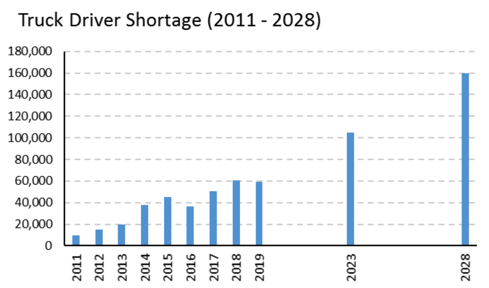

```{r setup, include=FALSE, cache=F, message=F, warning=F, results="hide"}
knitr::opts_chunk$set(cache=FALSE,
                      out.width='90%',
                      out.height='90%',
                      out.extra='keepaspectratio',
                      echo = FALSE)
#knitr::opts_chunk$set(fig.path='figs/')
```


### Overview of study

> Burks, S. V., & Monaco, K. (2019). Is the US Labor Market for Truck Drivers Broken. Monthly Lab. Rev., 142, 1.

The importance of trucking industry:

1. 61% of the total freight (by value)
2. 3.5% of GDP

U.S. Bureau of Labor Statistics (BLS) Occupational Employment Statistics (OES) survey 2017:

- 1.75 million heavy and tractor-trailer truck drivers
- 877,670 light truck or delivery services drivers
- 427,000 driver/sales workers

### Study setting

The American Trucking Association (ATA) has been arguing systematically a shortage of truck drivers [@ata].

<!--
1. a shortage of 20,000 drivers in 2005
2. a shortage of 50,700 drivers in 2017
3. a shortage of 160,000 drivers in 2028 
-->

```{r out.width='80%'}

```

ATA warns that the **driver supply will fail** as current drivers age.

### Population studied

- *U.S. Bureau of Labor Statistics (BLS) Occupational Employment Statistics (OES) survey*
    + A nationally representative survey of nonfarm business establishments with a large sample size.
    + Question: what are the employment and earnings of truck drivers relative to those of other workers?

- *Current Population Survey (CPS) data*
    + the patterns of occupations and industries from which drivers come and to which they go during the period 2003–17 
    + individual-level data
    + Question: why are the truck drivers switching jobs?


Results 1: OES
==============

### Employment of truck drivers and blue-collar workers

```{r}
knitr::include_graphics("figures/MLRFigure1.pdf")
```

### Earnings of truck drivers

```{r}
knitr::include_graphics("figures/MLRFigure2.pdf")
```

Results 2: CPS
==============

### Occupation retaining percentage

```{r}
knitr::include_graphics("figures/MLRFigure3.pdf")
```


### Who is entering truck driving industry?

```{r}
knitr::include_graphics("figures/MLRFigure4.pdf")
```

### Who is leaving truck driving industry?

```{r}
knitr::include_graphics("figures/MLRFigure5.pdf")
```

### CPS econometric models of occupational in-migration

```{=latex}
\begin{table}[]
\caption{{\footnotesize Probability of exiting truck driving between period 1 and period 2}}
\label{tab:my-table}
\resizebox{\textwidth}{!}{%
\begin{tabular}{@{}lcccc@{}}
\toprule
Variable &  \multicolumn{2}{c}{For-hire drivers} & \multicolumn{2}{c}{Private-carriage drivers} \\
 & Specification 1 &  Specification 2 & Specification 1 & Specification 2 \\
 \midrule
Standardized usual hours (period 1) & 0.779$^{***}$ (-5.52) &  — & 0.908** (-2.14) & — \\
Standardized weekly earnings (period 1) &  0.844$^{***}$ (-1.67) & — & 0.747$^{***}$ (-2.58) & — \\
Expected earnings increase &  — & 1.17 (1.34) & — & 1.41$^{***}$ (3.71)\\
Expected earnings decrease & — & 1.01 (0.06) &  — & 0.981 (-0.18) \\
Expected difference in hours (expected $–$ current) &  — &  1.03$^{***}$ (5.84) & — & 1.009$^{*}$ (1.93)\\
Standardized percentage of heavy trucks & — & — & 0.267 (-18.09) & 0.267$^{***}$ (-18.32)  \\
Observations &  5,465 & 5,465 & 6,202 & 6,202\\
\bottomrule
\end{tabular}%
}
\end{table}
```

### CPS econometric models of occupational out-migration

```{=latex}
\begin{table}[]
\caption{{\footnotesize Probability of entering truck driving in period 2 among occupational switchers}}
\label{tab:my-table2}
\resizebox{\textwidth}{!}{%
\begin{tabular}{@{}lcccc@{}}
\toprule
Variable &  \multicolumn{2}{c}{For-hire drivers} & \multicolumn{2}{c}{Private-carriage drivers} \\
 & Specification 1 &  Specification 2 & Specification 1 & Specification 2 \\
 \midrule
Standardized usual hours & 1.120$^{**}$ (-2.024) &  — & 1.115** (-2.47) & — \\
Standardized weekly earnings &  0.652$^{***}$ (-3.64) & — & 0.639$^{***}$ (-4.80) & — \\
Expected earnings increase &  — & 1.285$^{***}$ (2.06) & — & 1.318$^{***}$ (2.85)\\
Expected earnings decrease & — & 0.846 (-1.12) & — & 0.566$^{***}$ (-5.15) \\
Expected difference in hours (period 2 – period 1) &  — & 0.991 (-1.55) &  — & 0.992$^{*}$ (-1.69) \\
Observations &  85,977 & 85,977 & 86,298 & 86,298\\
\bottomrule
\end{tabular}%
}
\end{table}
```


Results 3: Perceived shortage
==============

### Explanation of perceived persistent truck driver shortage

Long-distance truckload (TL) motor freight, is a "secondary market".

- High levels of competition
- Similar average costs
- Limited ability to differentiate prices in the product market

Therefore, individual firms are forced to accept *high turnover* as a cost-minimizing strategy.

### Final conclusion

Although long-distance truck drivers has

- high turnover rates,
- problems of recruiting and retaining drivers,

This is not a "broken market". Overall the trucking industry is "healthy".

Implications
============

### Summary and implications

1. employment in the occupation has been resilient,
2. nominal annual wages have persistently exceeded blue-collar workers,
3. the occupations from which drivers come and to which they go are similar,
4. truck drivers have lower occupational migration than other workers with similar education levels.

Overall, the labor market for truck drivers works about as well as the labor markets for other blue-collar occupations

### Questions

1. How accurately did news article report these findings?

2. Limitations of this study?


### References {.allowframebreaks}
