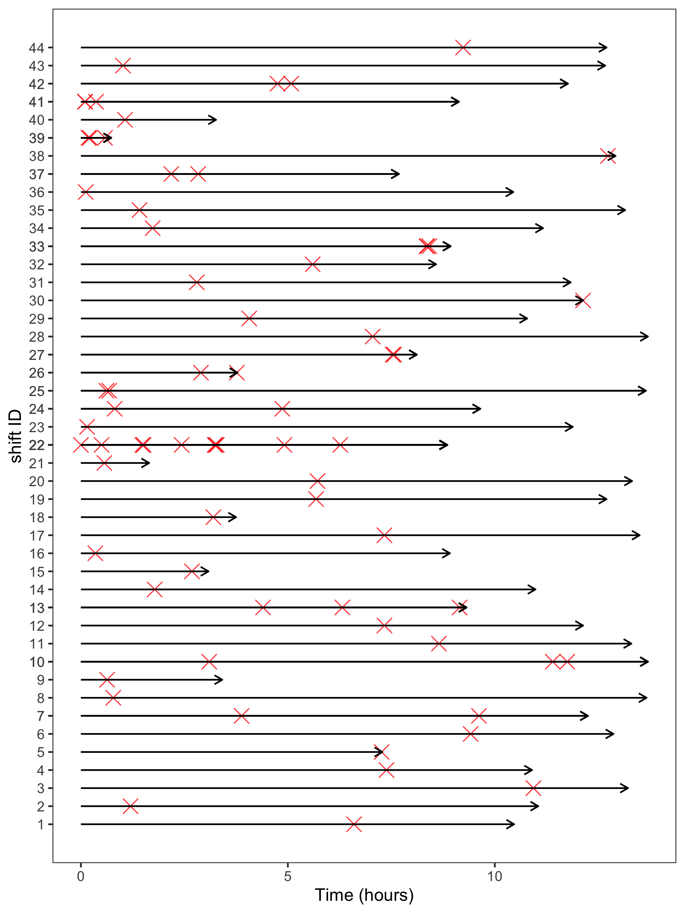

```{r setup, include=FALSE, cache=F, message=F, warning=F, results="hide"}
knitr::opts_chunk$set(cache=FALSE,
                      out.width='80%',
                      out.height='80%',
                      out.extra='keepaspectratio')
#knitr::opts_chunk$set(fig.path='figs/')
```

### Dissertation committee

- Chair:
    + Steven E. Rigdon, PhD

- Committee Members:
    + Fadel Megahed, PhD
    + Hong Xian, PhD

- At-large Committee:
    + Kenton Johnson, PhD
    + Juliet Iwelunmor, PhD
    
The problem
============

### Transportation and trucks

**Transportation safety** deserves attention:

- The 8-th leading cause of death globally in 2016, [@who2018]
- 1.4 million people were killed, mostly aged 4 to 44 years old, [@who2018]
- a loss of 518 billion dollars. [@dalal2013economics]

**Trucks** are the backbone of the economy:

- 70% of freights were delivered by trucks,
- 71.3% of domestic goods and 73.1% of value, [@olson2016weight; @anderson2017exploratory]

### Challenges for trucking industry

Drivers:

1. drive alone for long hours, 
2. work under time demands, challenging weather and traffic conditions,
2. sleep deprivation and disorders

Trucks: 

1. huge weights, 
2. large physical dimensions,
3. potentially carry hazardous cargoes.

### Truck crash studies

Traditional studies almost exclusively use data that ultimately trace back to **post hoc** __vehicle inspection__, __interviews__ with survived drivers and witnesses, and __police reports__. [@hickman2018synthetic; @stern2019data]

1. rare events $\rightarrow$ difficulty in estimation, [@theofilatos2018impact]
2. retrospective studies $\rightarrow$ recall bias, [@girotto2016professional]
3. crashes are under-reported $\rightarrow$ selection bias. [@ye2011investigation; @savolainen2011statistical]

### Naturalistic driving studies (NDS)

**\textcolor{slublue}{NDS}** uses 

> **unobtrusive** devices, sensors, and cameras installed on vehicles to **proactively** collect frequent naturalistic driving behavior and performance data under **real-world driving** conditions [@hickman2018synthetic; @guo2019statistical]

1. driver-based data, not road segment-based,
2. high-resolution driver behavior and performance data,
3. less costly and difficult per observation.

### Safety critical events (SCEs)

**\textcolor{slublue}{SCEs}** are

>  a chain of adverse events following an initial off-nominal event, which can result in an accident if compounded with additional adverse conditions. [@saleh2013accident]

Examples of SCEs are: 

1. hard brakes,
2. headways,
3. rolling stability,
4. collision mitigation

### The problem

NDSs are relatively new and less studied. Here are **several problems** in NDS.

1. Are SCEs indicative of real crashes among truck drivers?
2. Can we predict SCEs?
3. How can we innovate existing models to account for features of NDS?

Literature review
=================

### Crashes and SCEs

Examples of studies supporting SCEs:

- hard braking events were significantly associated with collisions and near-crashes, [@dingus2006100]
- a significant positive association between crashes, near crashes, and crash-relevant incidents, [@wu2014using]
- $\cdots$

Examples of studies that are against SCEs:

- overspeed negatively associated with injury crashes, [@gitelman2018exploring]
- no harm, no validity, [@knipling2015naturalistic]
- no demontration on causal link between SCEs and injury crashes. [@knipling2017threats]

Gaps:

- The number of drivers are limited and less convincing (<100),
- No studies specifically on truck drivers.

### Fatigue

The most important factor in transportation safety studies.

> a multidimensional process that leads to diminished worker performance, which may be a result of prolonged work, psychological, socioeconomic, and environment factors

- 16.5% of fatal traffic accidents, [@aaafoundation]
- 12.5% of injuries-related collisions, [@aaafoundation],
- 60% of fatal truck crashes. [@cavuoto2017understanding]

However, fatigue is hard to measure in transportation safety studies.

- ocular and physiological metrics,
- sleep patterns,
- **cumulative driving time**, 
- **night driving**.

### Other risk factors

Four aspects of risk factors are included in previous studies:

- Driver characteristics,
- Weather
- Traffic
- Road features
- $\cdots$

Gaps in literature:

1. Lack of high-resolution weather and traffic data,
2. No fusion of NDS and API data.

### Statistical models

- Logistic regression,
- Poisson regression,
- machine learning models,
- $\cdots$

Gaps in literature:

1. Road-centric models, not driver-centric models,
2. Maximum likelihood estimation (MLE) limited in rare-event models,
3. Lack of recurrent events models.

### Bayesian models

In the Bayesian perspective, parameters are viewed as random variables that have probability distributions: [@gelman2013bayesian]
\begin{equation}
\begin{split}
p(\theta | \mathbf{X}) & = \frac{p(\theta)p(\mathbf{X}|\theta)}{p(\mathbf{X})} \\
 & = \frac{p(\theta)p(\mathbf{X}|\theta )}{\int p(\theta)p(\mathbf{X}|\theta)d\theta}
\end{split}
\end{equation}

- $p(\theta)$: subjective priors,
- $p(\mathbf{X}|\theta)$: the likelihood function,
- $p(\mathbf{X}) = \int p(\theta)p(\mathbf{X}|\theta)d\theta$: the normalizing constant,
- $p(\theta | \mathbf{X})$: the posterior distribution.

The posterior distribution is a balance between the **prior beliefs** and the **likelihood function**.

### Challenges for Bayesian models in a big data setting

Modern Bayesian inferences replies on **Markov chain Monte Carlo (MCMC)** to overcome the intractable denominator issue. 

However, MCMC is not scalable in the big data setting:

- **Tall data** (a lot of observations),
- Wide data (a lot of variables),
- **Correlation between variables** (hierarchical models). [@kruschke2015bayesian]

Potential solutions:

- Hamiltonian Monte Carlo, [@betancourt2017conceptual]
- Subsampling MCMC such as energy conserving subsampling. [@dang2019hamiltonian]


### Conceptual framework

1. *Truck Driver Fatigue Model*, [@crum2002influence] 
2. *$5 \times$ ST-level hierarchy theory* in traffic safety,[@huang2010multilevel] 
3. *Commercial motor vehicle driver fatigue framework*.[@stern2019data]

```{r conceptmodel, fig.cap='Conceptual model. SCEs represent safety critical events.', echo=FALSE, eval=TRUE}
knitr::include_graphics("../figs/conceptual_model.png")
```

Research aims
=============

### Overall aim

Gaps in previous literature:

1. the association between crashes and SCEs has not been confirmed among truck drivers,
3. difficulty in fusing high-resolution NDS and API data,
4. Bayesian inference is not scalable in tall and wide NDS data setting,
2. recurrent events models were not widely applied in NDS data.

The overarching goal of this proposed dissertation is to construct **scalable Bayesian hierarchical models** for NDS data and understand how cumulative driving time and other factors will impact the performance of truck drivers.

### Aim 1

> To examine the association between truck crashes and SCEs using a Bayesian Gamma-Poisson regression.

I hypothesize that the **rate of crashes** is positively associated with the **rate of SCEs** among the truck drivers controlling for the miles driven and other covariates.

### Aim 2

> To construct three scalable Bayesian hierarchical models to identify  potential risk factors for SCEs. 

I hypothesize that the patterns of SCEs vary significantly from drivers to drivers and can be predicted using cumulative driving time, weather, road geometry, driver's age, and other factors.

- Bayesian hierarchical **logistic** regression,
- Bayesian hierarchical **Poisson** regression,
- Bayesian hierarchical **non-homogeneous Poisson process (NHPP)** with the power law process (PLP) intensity function.

### Aim 3

> To propose an innovative reliability model that accounts for both within shift cumulative driving time and between-trip rest time. 

I hypothesize that **between-trip rest time** can recover the intensity function by some proportion $\kappa$, and intensity function varies significantly from drivers to drivers.

Data
====

### Data sources {.allowframebreaks}

1. **Real-time ping**: vehicle number, date and time, latitude, longitude, driver identification number (ID), and speed at that second (every 2-10 minutes), ~1.4 billion pings (150 GB `.csv` file),
2. **Truck crashes and SCEs**: hard brakes, headways, and rolling stability were collected if kinematic thresholds were met,
3. **Driver demographics**: age,
4. **Weather from the DarkSky API**: precipitation intensity, precipitation probability, wind speed, and visibility,
5. **Road geometry from the OpenStreetMap**: speed limits and the number of lanes.

```{r ping, results='asis', eval=TRUE, echo=FALSE}
pacman::p_load(data.table, knitr, ggplot2, kableExtra)
ping = fread("../data/01_ping.csv")
ping[,ping_time := gsub("\"", "", ping_time)]

kable(ping[1:5,], "latex", align = "c", 
      booktab = TRUE, linesep = "",
      caption = "A demonstration of ping data")%>% 
  kable_styling(latex_options = c("scale_down"))
```

```{r SCE, results='asis', eval=TRUE, echo=FALSE}
fread("../data/11_SCE.csv") %>% 
  .[,event_time := gsub("T|Z", " ", event_time)] %>% 
  dplyr::slice(1:5) %>% 
  kable("latex", align = "c", 
      booktab = TRUE, linesep = "",
      caption = "A demonstration of safety critical events")
```

```{r crashes, results='asis', eval=TRUE, echo=FALSE}
fread("../data/10_crashes.csv") %>% 
  kable("latex", align = "c", 
      booktab = TRUE, linesep = "",
      caption = "A demonstration of crashes table") %>% 
  kable_styling(latex_options = c("hold_position", "scale_down"))
```

```{r drivers, results='asis', eval=TRUE, echo=FALSE}
fread("../data/12_driver.csv") %>% 
  dplyr::slice(1:5) %>% 
  kable("latex", align = "c", 
      booktab = TRUE, linesep = "", 
      caption = "A demonstration of drivers table")
```

```{r weather, results='asis', eval=TRUE, echo=FALSE}
fread("../data/13_weather.csv") %>% 
  .[,ping_time := gsub("T|Z", " ", ping_time)] %>% 
  dplyr::slice(1:5) %>% 
  kable("latex", align = "c", 
      booktab = TRUE, linesep = "",
      caption = "A demonstration of weather data from the DarkSky API") %>% 
  kable_styling(latex_options = c("hold_position", "scale_down"))
```

```{r road, results='asis', eval=TRUE, echo=FALSE}
fread("../data/14_OpenStreetMap.csv") %>% 
  dplyr::slice(25:29) %>% 
  kable("latex", align = "c", 
      booktab = TRUE, linesep = "", 
      caption = "A demonstration of road geometry data from the OpenStreetMap API")  %>% 
  kable_styling(latex_options = c("HOLD_position"))
```

### Data aggregation

1. **Trip**: for each of the truck drivers, if the real-time ping data showed that the truck was not moving for more than 20 minutes, the ping data will be separated into two different trips (~200,000 rows), 
2. **30-minute intervals**: as the length of a trip can vary significantly from 5 minutes to more than 8 hours, I will transform the trips data into 30-minute fixed intervals according to the starting and ending time of trips (~1 million rows),
2. **Shift**: the trips data will be further divided into different shifts if the specific driver was not moving for eight hours.

### Data merging

```{r datamerge, fig.cap='Flow chart of data aggregation and merging', echo=FALSE, eval=TRUE, out.width='100%', out.height='100%'}

```

### Data demonstration {.allowframebreaks}

```{r eval=TRUE, echo=FALSE}
pacman::p_load(dplyr, data.table, knitr, kableExtra)
agg30 = fread("../data/31-analyses_30_minute_intervals.csv")
shif = fread("../data/32-analyses_shifts.csv")
event_tab = fread("../data/33-analyses_events.csv")
```

```{r analysis30int, results='asis', eval=TRUE, echo=FALSE}
kable(agg30 %>% 
        dplyr::slice(1:5) %>% 
        dplyr::select(driver:SCE_type) %>% 
        dplyr::mutate(shift_start = gsub("T|Z", " ", shift_start),
                      shift_end = gsub("T|Z", " ", shift_end)), 
      "latex", align = "c", 
      booktab = TRUE, linesep = "", 
      caption = "30 minutes intervals data for hierarchical logistic and Poisson regression") %>% 
  kable_styling(latex_options = c("HOLD_position", "scale_down"))
#  landscape()
```

```{r analysisshift, results='asis', eval=TRUE, echo=FALSE}
kable(shif %>% 
        dplyr::slice(1:5) %>% 
        dplyr::select(driver:end_time), 
      "latex", align = "c", 
      booktab = TRUE, linesep = "",
      caption = "shifts data for hierarchical non-homogeneous Poisson process") %>% 
  kable_styling(latex_options = c("HOLD_position", "scale_down"))
#  landscape()
```

```{r analysisshiftevent, results='asis', eval=TRUE, echo=FALSE}
kable(event_tab %>% 
        dplyr::slice(1:5) %>% 
        dplyr::mutate(start_time = gsub("T|Z", " ", start_time),
                      event_time = gsub("T|Z", " ", event_time),
                      shift_length = round(shift_length, 3),
                      time2event = round(time2event, 3)), 
      "latex", align = "c", 
      booktab = TRUE, linesep = "",
      caption = "SCEs data for hierarchical non-homogeneous Poisson process") %>% 
  kable_styling(latex_options = c("HOLD_position", "scale_down"))
```

Methods
=======

### Aim 1 - Data and variables

> The first aim seeks to determine the association between the rate of crashes and the rate of SCEs at the level of drivers. 

- **Data**: the original ping data table that has 1,494,678,173 pings in total and crashes. Only drivers with at more than 100 pings will be included. The cleaned ping data will be aggregated to trips.

- **outcome variable**: the number of crashes for each driver. 

- **The primary independent variable**: the number of SCEs per 10,000 miles. These SCEs will be further decomposed into the number of hard brakes, headways, and rolling stability per 10,000 miles in similar analysis. 

- **The covariates**: the total miles driven, the percent of night driving, and the age of the drivers.

### Aim 1 - Gamma-Poisson model

Here is how the proposed Gamma-Poisson model will be implemented. Let us assume that:
$$
\begin{aligned}
\lambda & \sim \text{Gamma}(\alpha, \beta)\\
X|\lambda & \sim \text{Poisson}(\lambda)\\
\end{aligned}
$$
Then we have:
$$X \sim \text{Gamma-Poisson}(\alpha, \beta)$$
The Gamma-Poisson distribution is a $\alpha$-parameter distribution, with the $\alpha$ as a measure of overdispersion. The Gamma-Poisson distribution  has the probability mass function of:
$$f(x) = \frac{\Gamma(x + \beta)\alpha^x}{\Gamma(\beta)(1 + \alpha)^{\beta + x}x!}, \quad x = 0, 1, 2, \dots$$

The log-linear Gamma-Poisson model will be specified as:
$$
\log\beta = \mathbf{X\gamma} - \log m,
$$
where $\mathbf{X}$ is the predictor variables matrix, including the percent of night driving and the age of the drivers, $\mathbf{\gamma}$ is the associated $2*1$ parameter vector, $m$ is the total miles driven as an offset term in the Poisson distribution, and $\alpha$ is a fixed overdispersion parameter that does not depend on any covariates.

### Aim 1 - potential problems and alternative plans

> The sheer size of the original ping data may be a problem in aim 1: the ping data has 1,494,678,173 rows and 9 columns, ( >140 gigabytes (GB) `.csv`). 

Although I will use the OSC server that has Random-Access Memory (RAM) of more than 500 GB, it may still be hard to read and process this giant file. 

1. If the OSC server cannot handle the data correctly, I will separate the single gaint csv file into __several small csv files__ according to driver ID, then aggregate the pings to trips for each small csv file. 
2. After the ping data are aggregated to trips, it is unlikely that the log-linear Gamma-Poisson model fail. In that unlikely event, I can turn to __negative binomial models__ or use __traditional MLE estimates__ instead of Bayesian estimation.

### Aim 2

> The purpose of aim 2 is to develop three **scalable hierarchical Bayesian statistical and reliability models** for the SCEs of truck drivers and identify potential risk factors.

- **vehicle drivers** will be viewed as the sampling unit. 
- **Outcome**: SCEs,
- **Predictors**: driver-level random-effects, age, cumulative driving time, weather, road geometry, mean speed, and speed variation,

### Aim 2 - Bayesian hierarchical logistic regression

\begin{equation}
\begin{split}
Y_{i} &\sim \text{Bernoulli}(p_{i})\\
\log\frac{p_{i}}{1-p_{i}} &= \beta_{0, d(i)} + \beta_{1, d(i)} \cdot \text{CT}_i + \sum_{j=1}^{J} x_{ij}\beta_j\\
\beta_{0, d} &\sim \text{i.i.d. } N(\mu_0, \sigma_0^2), \quad d = 1, 2, \cdots, D\\
\beta_{1, d} &\sim \text{i.i.d. } N(\mu_1, \sigma_1^2), \quad d = 1, 2, \cdots, D
\end{split}
\end{equation}

- $Y_{i}$: whether SCEs occurred in the 30-minute interval or not (binary),
- $\beta_{0, d(i)}$: random intercepts for each driver, $\beta_{1, d(i)}$ is random slopes for cumulative driving time CT$_i$,
- $\beta_2, \beta_3, \cdots, \beta_J$: fixed parameters for covariates $x_{ij}$.
- $\mu_0, \sigma_0$: hyper-parameters for random intercepts $\beta_{0, d}$, 
- $\mu_1, \sigma_1$: hyper-parameters for random slopes $\beta_{1, d}$.

### Priors

Since we do not have much prior knowledge on the parameters, I will assign weakly informative priors [@gelman2017prior] for these parameters:
\begin{equation}
\begin{split}
		\mu_0 & \sim N(0, 5^2)\\
		\mu_1 & \sim N(0, 5^2)\\
		\sigma_0 & \sim \text{Gamma}(1, 1)\\
		\sigma_1 & \sim \text{Gamma}(1, 1)\\
		\beta_2, \beta_3, \cdots, \beta_J  & \sim N(0, 10^2)
\end{split}
\end{equation}

The priors for the hyperpriors need to be relatively more restrictive than priors for fixed-effects parameters $\beta_2, \beta_3, \cdots, \beta_J$ [@gelman2013bayesian].

### Aim 2 - Bayesian hierarchical Poisson regression

\begin{equation}
\begin{aligned}
N_{i}  & \sim \text{Poisson}(T_i\cdot\lambda_i)\\
\log\lambda_{i} & =\beta_{0, d(i)} + \beta_{1, d(i)} \cdot \text{CT}_i + \sum_{j=1}^{J} x_{ij}\beta_j\\
\beta_{0, d} &\sim \text{i.i.d. } N(\mu_0, \sigma_0^2), \quad d = 1, 2, \cdots, D\\
\beta_{1, d} &\sim \text{i.i.d. } N(\mu_1, \sigma_1^2), \quad d = 1, 2, \cdots, D
\end{aligned}
\end{equation}

- $Y_{i}$: the number of SCEs occurred in the 30-minute interval,
- $T_i$: length of the 30-minute interval,
- The other components are the same as those in hierarchical logistic regression.

The scalable Bayesian statistical and reliability models will be conducted using the **HMC-ECS algorithm** (self-defined functions in `Python 3.6.0`) or **HMC** (the `rstan` package in statistical computing environment `R 3.5.1`) [@rstancitation; @Rcitation; @dang2019hamiltonian].

### Aim 2 - recurrent event models

```{r arrowplot, fig.cap='An arrow plot of time to SCEs in each shift', echo=FALSE, eval=TRUE}

```

### Aim 2 - theories on NHPP and PLP

**Nonhomogeneous Poisson Process (NHPP)**:

> a Poisson process whose intensity function is non-constant. 

**Power law process (PLP)**: a NHPP with the intensity function of:
\begin{equation}
\lambda(t) = \frac{\beta}{\theta}\bigg(\frac{t}{\theta}\bigg)^{\beta-1}, \quad \beta > 0, \theta > 0
\end{equation}

- $\beta > 1$: intensity increasing $\rightarrow$ reliability deteriorating,
- $\beta = 1$: constant intensity $\rightarrow$ reliability not changing,
- $\beta < 1$: intensity decreasing $\rightarrow$ reliability improving,
- $\theta$: scale parameter.

There are two forms of truncation in a NHPP: 

1. *Failure truncation*: when testing stops after a predetermined number of failures, 
2. *Time truncation*: when testing stops at a predetermined time $t$.

### Notations

Let $T_{d, s, i}$ denotes the time to the $d$-th driver's $s$-th shift's $i$-th critical event. The total number critical events of $d$-th driver's $s$-th shift is $n_{d,s}$. The ranges of these notations are:

- $i = 1, 2, \cdots, n_{d, S_d}$: SCE ID,
- $s = 1, 2, \cdots, S_d$: shift ID,
- $d = 1, 2, \cdots, D$: driver ID.

### Bayesian hierarchical NHPP with PLP intensity function

Assume that the times of critical events within the $d$-th driver's $s$-th shift were generated from a PLP, with a fixed shape parameter $\beta$ and varying scale parameters $\theta_{d, s}$ across drivers $d$ and shifts $s$.
\begin{equation}
\begin{aligned}
  T_{d, s, 1}, T_{d, s, 2}, \cdots , T_{d, s, n_{d, s}} & \sim \text{PLP}(\beta, \theta_{d, s})\\
  \beta & \sim \text{Gamma}(1, 1)\\
  \log\theta_{d, s} &= \gamma_{0d} + \gamma_{1}x_{d, s, 1} + \gamma_{2}x_{d, s, 2} + \cdots + \gamma_{k}x_{d, s, k}\\
  \gamma_{01}, \gamma_{02}, \cdots, \gamma_{0D} & \sim \text{i.i.d. }N(\mu_0, \sigma_0^2)\\
  \gamma_1, \gamma_2, \cdots, \gamma_k & \sim \text{i.i.d. }N(0, 10^2)\\
  \mu_0 &\sim N(0, 10^2) \\
  \sigma_0 &\sim \text{Gamma}(1, 1)
\end{aligned}
\end{equation}
The shape parameter $\beta$ shows the reliability changes of drivers.

### Aim 2 - potential problems and alternative plans

> The sheer size of the 30-minute interval table and merged shifts table may be a problem in this aim. 

- The 30-minute interval table: ~ one million rows and 10 variables, 
- Merged shift table: ~200,000 rows and 10 variables. 
- 496 random intercepts and slopes

Although I propose to use the HMC-ECS to estimate the random effect, there are still chances that the model does not work. In that case, I will **sample 50 to 200 typical drivers**, then conduct the analysis based on this smaller sample data. In the unlikely event that the models still fails based on this smaller data, I can restrict the hierarchical models to **random intercepts only model** or use **traditional MLE** instead of Bayesian estimation.

### Aim 3

> Aim 3 seeks to innovate the NHPP with a PLP intensity function proposed in Aim 2 by adding one more parameter $\kappa$. 

I propose to account for the rest time within a shift by adding one more parameter $\kappa$, **the percent of reliability recovery during a break within a shift**. 

This new reliability model (**jump-point PLP (JPLP)**) will be between a *NHPP* where the intensity function is not influenced by between-trip rests ("as bad as old"), and a *renewal process* where the intensity function is fully recovered by between-trip rests ("as good as new").

### Aim 3 - intensity function of NHPP

```{r plpjumppoint, fig.cap='Intensity function, time to SCEs, and rest time within a shift generated from a NHPP with a PLP intensity function, $\\beta = 1.2$, $\\theta=2$', echo=FALSE, eval=TRUE}
knitr::include_graphics("../figs/PLP_NHPP_intensity.pdf")
```

### Aim 3 - intensity function of proposed jump-point PLP (JPLP)

```{r plpnhpp, fig.cap='Intensity function, time to SCEs, and rest time within a shift with a jump-point PLP intensity function, $\\beta = 1.2$, $\\theta=2$, $\\kappa=0.8$', echo=FALSE, eval=TRUE}
knitr::include_graphics("../figs/PLP_jump_point_intensity.pdf")
```

### Aim 3 - JPLP

Here I assume that the times of critical events within the $d$-th driver's $s$-th shift were generated from a JPLP, with a fixed shape parameter $\beta$, varying scale parameters $\theta_{d, s}$ across drivers $d$ and shifts $s$, and **an added parameter $\kappa$**.
\begin{equation}
\begin{aligned}
  T_{d, s, 1}, T_{d, s, 2}, \cdots , T_{d, s, n_{d, s}} & \sim \text{JPLP}(\beta, \theta_{d, s}, \kappa)\\
  \beta & \sim \text{Gamma}(1, 1)\\
  \log\theta_{d, s} &= \gamma_{0d} + \gamma_{1}x_{d, s, 1} + \gamma_{2}x_{d, s, 2} + \cdots + \gamma_{k}x_{d, s, k}\\
  \kappa & \sim \text{Uniform}(0, 1)\\
  \gamma_{01}, \gamma_{02}, \cdots, \gamma_{0D} & \sim \text{i.i.d. }N(\mu_0, \sigma_0^2)\\
  \gamma_1, \gamma_2, \cdots, \gamma_k & \sim \text{i.i.d. }N(0, 10^2)\\
  \mu_0 &\sim N(0, 5^2) \\
  \sigma_0 &\sim \text{Gamma}(1, 1)
\end{aligned}
\end{equation}

- $\beta$: shape parameter that reflects the reliability changes of drivers,
- $\theta_{d, s}$: a scale parameter,
- $\kappa$: the percent of intensity function recovery once the driver takes a break.

### Aim 3 - potential problems and alternative plans

In the unlikely event that the JPLP fails to be models, I will use the **modulated PLP** proposed by @black1996statistical. The modulated PLP has well-defined data generating process, intensity function, and joint-likelihood functions. If the JPLP does not work, I will revise the modulated PLP into **a hierarchical modulated PLP**. 

\vspace{20pt}

The hierarchical JPLP and hierarchical modulated PLP will be estimated using `Stan` programs by adding self-defined likelihood function, which can be accessed via the `rstan` package in statistical computing environment R 3.5.1 on the OSC [@rstancitation; @Rcitation; @OSC1987].

### References {.allowframebreaks}
