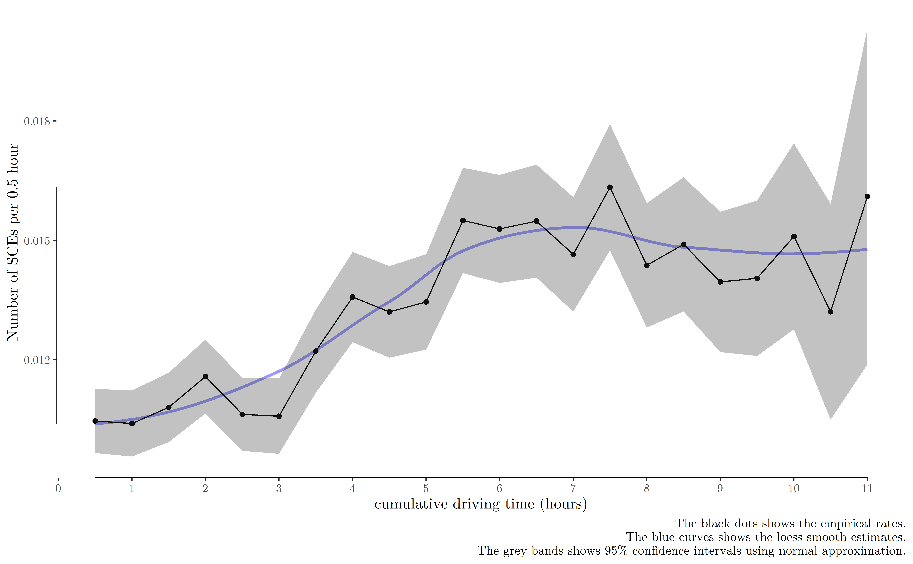

\newcommand{\blandscape}{\begin{landscape}}
\newcommand{\elandscape}{\end{landscape}}
\setlength\footskip{1.8cm}
\doublespacing

```{r setup, include=FALSE}
knitr::opts_chunk$set(echo = FALSE, message=FALSE, fig.align = "center", 
                      out.width='\\textwidth')
#, fig.pos = 'H'
```

Introduction {#intro}
============
The World Health Organization [@who2018] estimated that road injury claimed around 1.4 million lives globally in 2016, which was the eighth leading cause of death. Among all types of vehicles on road, large trucks are a concern since they are more frequently involved in catastrophic crashes. In the United States, @nhtsa2017 reported that 4.3% of registered vehicles were large trucks or buses, but they account for 12.4% of vehicle-related fatalities [@hickman2018synthetic]. Truck drivers are often on the road for long routes under on-time demands, complex traffic and weather conditions, with little to no supervision and contact with fellow workers. Therefore, trucking safety is an important research topic and a number of studies have been published to predict and reduce crash risk associated with trucks [@cantor2010driver; @chen2015hierarchical; @dong2017estimating].

Traditional crash prediction studies collect retrospective police reports of crashes in a given road section for a specified time period, match these crash cases with non-crash controls (typically 1 to 4 matching), and then build statistical models (such as logistic regression and neural networks) to study the risk factors associated with higher risk of crashes and predict real crashes [@blower2010condition; @sharwood2013use; @meuleners2017determinants]. This case-control study design is efficient and less time-consuming in the field of trucking safety since crashes are very rare. However, case-control studies, by nature, are limited in study design since a) it is impossible to estimate and compare the rate of crashes since the number of non-crashes is unknown, b) retrospective reports are often subject to recall and report bias: the drivers may not accurately recall the exact conditions at the time of the event, c) the drivers may intentionally conceal some critical facts to escape from legal punishment [@dingus2011estimating; @stern2019data].

Naturalistic driving studies (NDSs) have been emerging in the past decade thanks to the advancement of technology. An NDS continuously collects driving data (including latitude, longitude, and speed) under real-world conditions using on-board unobtrusive equipment [@guo2019statistical]. In contrast to retrospective reports, an NDS resembles a cohort study: a pre-determined set of drivers are prospectively followed for a certain amount of time. Therefore, NDS has several advantages. First, NDS collects both crashes and non-crashes, so it is more useful in comparing the rates of events. Second, since vehicle crashes are extremely rare, it may take a huge amount of driving time to have sufficient sample of crashes. Instead, NDS focus safety-critical events (SCEs), which is defined as events that avoid crashes by last-second evasive maneuver [@dingus2011estimating]. SCEs can be 1000 times as high as real crashes and are argued to be good surrogates of crashes [@guo2010near; @dingus2011estimating; @mahmud2017application; @johnsson2018search]. Third, NDS data are collected using programmed instruments or sensors, so they are less likely to be subject to human error, recall  bias, or misinformation. Lastly, NDS collects data every a few seconds to minutes, and this large-scale high-resolution data provide a promising opportunity to quantifying driving risk [@guo2019statistical].

However, many issues arise given the characteristics of NDSs. First, the sheer volume of NDS data creates a challenge to data management and aggregation [@mannering2014analytic]. For example, a NDS data set can have billions rows of real-time speeds and locations, and it is important to have scalable and high-performance tools to aggregate these data into units that fit into the framework of statistical modeling. Second, routinely collected NDS data only have vehicle driving data. Crucial environmental variables such as weather and traffic need to be accessed from other data sources and merged back to the driving data. Third, even with these data sources, management, and aggregation issues solved, there is a lack of consensus on choosing the statistical models that are both sufficiently complex to account for the characteristics of NDS and computationally feasible to fit the large-scale data. With increasing companies collecting NDS data on a regular basis, a scalable and generalizable analyzing framework can serve as a pattern for researchers to better understand NDS data and gain insights into trucking and transportation safety.

This paper aims to propose and showcase a generalizable data analytic framework (data collecting, aggregating, fusing, and driver-centric statistical modeling) that accounts for the features of NDS data. To achieve this aim, we addressed the following questions:

  (A) How should we aggregate the high-resolutional NDS data into statistically analyzable units?
  (B) Where are the third-party data sources available to transportation data analytic studies? 
  (C) What are the risk factors associated with risky driving behavior among the sample truck drivers?

The remainder of this paper is organized as follows. Section \@ref(lit-review) provides a brief literature review on previously published studies that use NDS data sets. Then, Section \@ref(data-source) presents our NDS data and other third-party data sources. Section \@ref(data-preparation) demonstrates how we aggregate the ping data into shifts, trips, and 30-minute intervals, and merge different data sources. Section \@ref(statsmodels) details the driver hierarchical logistic and negative binomial model. Section \@ref(results) presents the statistical results and interpretation and conclusions and implications are discussed in Section \@ref(conclusions).


Literature review {#lit-review}
=================
Although NDS data only emerge in the recent decade and are relatively new, there are an increasing number of data analytic studies published using this data. In this section, instead of exhaustively reviewing all published papers, we introduced a few recent papers that build statistical models  using NDS data sets (either trucks or more general vehicles). The data, methods, and results of these papers are briefly outlined and compared, we then identify and summarize the research gaps.

Table \@ref(tab:tablitreview) presents eight data analytic studies that use NDS data. These studies extract the outcomes and features (such as driving time, sleep patterns, and traffic) potentially associated with driving risk from NDS data sets, then the relationship between the outcome variables and predictors is explored using statistical models. From the listed papers, we could observe the following issues in previously published studies:

(A) The number of sample drivers are small (around 100 drivers) except for @wali2019exploring. The studies may not have sufficient statistical power due to the small sample size, and the generalizability may be limited.

(B) The data sources come from only NDS data sets, which increases the workload and difficulty of data collection. In secondary data analysis, exclusively replying on one data source may limit our power to answer the question. With various organizations collecting data, we can exploit the power of third-party data providers, integrate different sources of data, and as a consequence, improve the prediction accuracy of statistical models.

(C) Although the listed papers occasionally used hierarchical models, relatively few actually used driver-centric hierarchical models. NDS data sets are naturally generated by a driver-centric process: recruited drivers are followed for a certain amount of time, and all relevant data are collected in this process.

(D) No consistent framework for cleaning, aggregating, and statistical modeling has been proposed in these papers. NDS data sets collects large-scale high-resolutional data, which rely on a context-specific, statistically sensible, and computationally affordable to analyze and empower policy making.

Our study serves as a complement to the existing literature and a model for future NDS studies. Firstly, we combined routinely collected driving data of 497 commercial truck drivers and a third-party weather data provider. Then, a contextual sensible data aggregation framework is proposed to reduce the original driving data to shifts, trips, and 30-minute intervals. Lastly, we propose to use driver-centric mixed-effect statistical models to analyze the aggregated data.

```{r}
pacman::p_load(dplyr, knitr, kableExtra)
readxl::read_excel("references/review.xlsx") %>% 
  select(2:8) %>% 
  arrange(Year, Authors) %>% 
  kable("latex", 
        booktabs = T, 
        caption = "A review of sample size, outcomes, predictors, statistical models, and results in previous NDS data analytic studies",
        label = "tablitreview") %>% 
  kable_styling(full_width = F, latex_options = "hold_position") %>% 
  column_spec(1, width = "6em") %>% 
  column_spec(3, width = "6em") %>% 
  column_spec(4, width = "7em") %>% 
  column_spec(5, width = "12em") %>% 
  column_spec(6, width = "12em") %>% 
  column_spec(7, width = "12em") %>% 
  landscape() 
```


Data sources {#data-source}
============
The data were collected by a leading freight shipping trucking company (we will name it as Company A for confidentiality reasons) in the United States. From April 2015 to March 2016, the company equipped all their trucks with in-vehicle data acquisition systems (DAGs) that collect real-time *ping* and *SCEs* data. Details of these two data sources will be introduced in Subsection \@ref(pingdata). The study protocol was reviewed and approved by the Institutional Review Board of Saint Louis University.

For demonstration purposes, we sampled 497 regional truck drivers who move freights in a region and surrounding states in this study. Apart from these vehicle driving data, demographic variables including age, gender, and race were also provided to the research team. The drivers were anonymized to ensure confidentiality, while a unique identification number was provided for each driver to link the three data sources. The average age of the sample drivers was 45.83 (standard deviation: 12.03), with 36 female drivers (7.2%). There were 247 whites (49.7%), 206 blacks (41.4%), and 44 other races (8.9%). 

Ping and SCEs data {#pingdata}
------------------
The DAGs ping irregularly (typically every a couple of seconds to minutes) as the truck goes on road. Each ping collects several key variables, including the date and time (year, month, day, hour, minute, and second), latitude and longitude (specific to five decimal places), driver identification number (ID), and speed at that second. In total, 13,187,289 rows of ping data were generated by the 497 truck drivers, with 8,029,087 (60.89%) of them were active pings (speed of the ping is not zero).

```{r eval=FALSE}
d = data.table::as.data.table(fst::read_fst("data/cleaned/01a_ping_original_500drivers.fst"))
d[,sum(speed > 0)]
d[,sum(speed > 0)/.N]
```


Apart from ping data, Company A also collected real-time SCEs data for all their trucks. In contrast to irregularly collected ping data, SCEs were recorded whenever pre-determined kinematic thresholds were triggered.
There were 9,032 critical events occurred to these 497 truck drivers during the study period. Four types of critical events were recorded in this critical events data, including 3,944 headway (43.67%), 3,588 hard brakes (39.72%), 869 collision mitigation (9.62%), 631 rolling stability (6.99%).

```{r eval=FALSE}
pacman::p_load(data.table, dplyr)
d = fst::read_fst("data/cleaned/11ping_add_trip_shift_id.fst") %>% 
  as.data.table()
d30 = fst::read_fst("data/cleaned/32interval30_CE_11hours_limit.fst") %>% 
  as.data.table()
d30[,.N,driver]
d30[,sum(nCE)] # 9032

sce = fst::read_fst("data/cleaned/04safety_critical_events.fst") %>% 
  as.data.table()

trip_id = d30 %>% 
  .[,.(driver, interval_id, shift_id, trip_id, start_time, end_time)] %>% 
    setkey(driver, start_time, end_time) 

sce1 = sce %>% 
  .[,dummy := event_time] %>% 
  setkey(driver, event_time, dummy) %>% 
  foverlaps(trip_id, mult = "all", type = "within", nomatch = NA) 
sce1[,sum(!is.na(interval_id))]# 9032

sce1[!is.na(interval_id),.N, event_type]
```


Weather
-------
Weather is one of the most studied risk factors associated with trucking safety [@zhu2011comprehensive; @naik2016weather; @uddin2017truck]. In this study, we obtained historic weather data from the DarkSky Application Programming Interface (API), which allows us to query historic real-time and hour-by-hour nationwide historic weather conditions according to latitude, longitude, date, and time [@darksky]. The primary weather variables included visibility, precipitation probability^[Ideally, historic precipitation at a specific location and time should be yes or not. However, in reality, since the weather stations are distributed not densely enough to record the exact weather conditions in every latitude and longitude in the US, the DarkSky API uses their algorithms to infer the probability of precipitation in each location.], precipitation intensity, wind speed, and others. To reduce the cost of querying all 13 million ping data from the DarkSky API, we rounded the GPS coordinates to the second decimal places, which are worth up to 1.1 kilometers, and we also round the time to the nearest hour. Then the weather variables were queried from the DarkSky API using the approximated latitudes, longitudes, date and hour.

Traffic and road geometry can be collected from Google map API and OpenStreetMap API. However, querying historic traffic data for all our sample pings from Google map will create costs higher than the budget of the research team. The OpenStreetMap API is open-sourced and free platform that provides road geometry data (including speed limit and the number of lanes), but the missing rate (> 50%) is too high to be of practical use for sample pings in this study. Therefore, we did not use traffic data or road geometry data in this study. We shared our R code to extract weather (the DarkSky API) and road geometry data (the OpenStreetMap) in the Supplementary materials.


Data preparation {#data-preparation}
================
Shifts, trips, and 30-minute intervals
----------------
To convert this 13 million row real-time ping data into analyzable units, we aggregate them into *shifts*, *trips*, and *30-minute intervals*, which are inspired by real world truck transporting practice and the hours-of-service policy by @hosrule. Shifts are on-duty periods with no breaks longer than eight hours (there can be short breaks less than 8 hours). Trips are continuous driving periods with no breaks less than half an hour. These trips are further divided into 30-minute fixed intervals. This is because trips can vary from several minutes to several hours, which are not a good analyzable unit for statistical modeling. The details of the aggregation process is as follows:

- *Shifts*: for each of the sample truck drivers, if the ping data showed that the truck was not moving for more than eight hours, the ping data were separated into two different shifts on the left and right side of this long break. There could be several short breaks (less than eight hours) within each shift. 
- *Trips*: for each shift, if the ping data showed that the truck was not moving for more than half an hour, the ping data were separated into different trips. These ping data were then aggregated into different trips. The drivers are assumed to be fully driving within each trip since there are not breaks longer than 30 minutes within each trip. The trips are nested within shifts.
- *30-minute intervals*: each trip is further decomposed into 30-minute fixed intervals according to the start and end time of the trip. The last interval of the trip is typically less than 30 minutes. The 30-minute intervals are nested within trips.

```{r dataagg, fig.cap='Data aggregation process from pings to shifts, trips, and 30-minute intervals.'}
knitr::include_graphics("figures/ping_data_aggregation.pdf")
```

Figure \@ref(fig:dataagg) visually present the data aggregation process of ping $\rightarrow$ shifts $\rightarrow$ trips $\rightarrow$ 30-minute intervals, as well as the nested structure. The y-axis is speed and x-axis is time. Each dot is a ping, and the color of that ping indicate the current speed. Grey dots indicate stopping pings with the current speed of zero. The arrows in the lower part represent the aggregated shifts (blue), trips (purple), and 30-minute intervals (green). The long blue arrows (shifts) are separated and defined by long grey dots (more than eight hours) in the middle of the figure. Similarly, the shorter purple arrows are separated and defined by shorter grey dots (greater than half an hour but less than eight hours). The shortest green line segments (30-minute intervals) are defined by the start and end time of the purple arrows, and these 30-minute intervals are much more homogeneous in length than shifts and trips.

Data fusion
-----------
Driver demographic variables were merged to the 30-minute intervals using driver unique IDs. Weather variables were firstly merged to the original ping data using unique latitude, longitude, and time combinations, and then aggregated to 30-minute intervals by taking the average of the weather variables. The SCEs were merged to the 30-minute intervals by matching driver IDs and if the time of the SCEs falls in between the start and end time of the intervals. The data aggregation and fusion process is empowered by the R package `data.table` to leverage its high-speed and multi-thread in-memory modification, aggregation, grouping, and joining performance for large data sets [@citedatatable]. The code is shared in the Supplementary materials.

Cumulative driving time as a measure of fatigue
-------------------
Fatigue is the most important predictor of truck crashes [@cavuoto2016understanding; @maman2017data; @stern2019data]. However, driver fatigue is difficult to measure in real life [@hartley1994indicators]. In this study, we use cumulative driving time within each shift for each driver as a proxy measure of the fatigue of truck drivers[@mccauley2013dynamic]. It is calculated by adding up the 30-minute interval times in each shift for each driver, and the rest time between trips and shifts were not included.


Statistical models {#statsmodels}
==================
Traditional statistical models assume that observations are independent from each other given their predictor variables. However, natural data are almost never independent given the predictor variables. In the example of truck driver's safety events, if we assume the external traffic, weather and driver's socioeconomic status are fixed, truck drivers may exhibit similar driving patterns in multiple trips, and then drivers hired by the same company may share similar culture and safety atmospheres. Therefore, traffic accidents are naturally nested within drivers and drivers are nested within companies. Traditional statistical models that assume independence between observations are not appropriate in this case since objects tend to be similar within a group. Hierarchical models, also known as multilevel model, random-effects model or mixed model, have been developed to allow for the nested nature of data. Instead of assuming independence given predictor variables, hierarchical models assume conditional independence. Hierarchical models are advocated to be the default method since they can produce more precise prediction and more robust results than traditional models. [@han2018investigating; @pantangi2019preliminary]

Here we model the probability of a critical event occurred using two hierarchical models: logistic and negative binomial (NB) regression models. In the hierarchical logistic regression model, we categorized the number of safety events during the $i$-th 30-minute interval into a binary variable $Y_i$ with the value of either 0 or 1, where 0 indicated that no critical event occurred during that trip while 1 indicated that at least 1 critical event occurred during the trip. The hierarchical logistic regression model is parameterized as:
\begin{align}
	\label{eq:logit}
	\begin{split}
		Y_i & \sim \text{Bernoulli}(p_i)\\
		\log\frac{p_i}{1 - p_i} & = \beta_{0, d(i)} + \beta_{1, d(i)} \cdot \text{CT}_i + \beta_2x_2 + \cdots + \beta_kx_k\\
		\beta_{0, d(i)} &\sim N(\mu_0, \sigma_0^2)\\
		\beta_{1, d(i)} &\sim N(\mu_1, \sigma_1^2).\\
	\end{split}
\end{align}
Here $d(i)$ is the driver for interval $i$, $\beta_{0, d(i)}$ is the random intercept for driver $d(i)$; $\beta_{1, d(i)}$ is the random slope for the cumulative driving time (CT$i$) in the shift (the sum of driving time for all previous intervals within that shift) for driver $d(i)$. These random intercepts and random slopes are assumed to have a hyper-distribution with hyperparameters $\mu_0, \sigma_0, \mu_1, \sigma_1$. $x_2, \ldots, x_k$ are other fixed-effect variables including driver demographics (age, gender, and race), weather (visibility, precipitation intensity and probability), interval specific variables (mean and standard deviation (s.d.) of speed), and $\beta_2, \ldots, \beta_k$ are the associated parameters.

Although logistic regression is more robust to outliers of the outcome variable in each 30-interval, it does not fully use the information in the outcome variable since only a binary variable is used. Here we present a hierarchical NB model, with the number of SCEs $Y_i^\star$ within the $i$-th interval as the outcome variable. The hierarchical NB regression model is parameterized as:
\begin{align}
	\label{eq:nb}
  \begin{split}
		Y_i^\star & \sim \text{NB}(T_i\times\mu_i, \; \mu_i + \frac{\mu_i^2}{\theta})\\
		\log\mu_i & = \beta_{0, d(i)}^\star + \beta_{1, d(i)}^\star \cdot \text{CT}_i + \beta_2^\star x_2 + \cdots + \beta_k^\star x_k\\
		\beta_{0, d(i)}^\star &\sim N(\mu_0^\star, \sigma^{\star 2}_0)\\
		\beta_{1, d(i)}^\star &\sim N(\mu_1^\star, \sigma^{\star 2}_1).\\
	\end{split}
\end{align}

Here $T_i$ is the length of the $i$-th interval, $\mu_i$ is the expected number of SCEs per hour, $\theta$ is a fixed over-dispersion parameter. Since there is no good solution to estimate the $\theta$ parameter here, it was set as a fixed value estimated from a Poisson regression using maximum likelihood estimation. Other parameters are similar and explained in the previous hierarchical logistic regression model, and we put a $\star$ on the parameter to note the difference between the parameters of the two models. 

To compare with models without driver-level random effects, we also estimated logistic and NB regression models without any random effects. Log likelihood, the Akaike Information Criterion (AIC), the Bayesian Information Criterion (BIC), and $c$-statistic were reported to assess model fit. The hierarchical logistic and NB models were estimated using the `lme4` R package [@citelme4], and model fit statistics were generated using `finalfit` R package [@citefinalfit]. All the analyses were conducted in statistical computing environment R 3.6.2 [@citebaseR]. The data and associated R code can be accessed in the supplementary materials.


Results and discussion {#results}
======================
Geographic distribution of sample pings
---------------------------------------
```{=latex}
\begin{figure}%[htb]
    \centering
    \begin{subfigure}[a]{\textwidth}
        \centering
        \includegraphics[width=\linewidth]{figures/Projected_map_active_ping_Aim2_NOROAD.png}%
        \caption{Active pings}
        \label{fig:pointpatternA}
    \end{subfigure}
    \vskip\baselineskip
    \begin{subfigure}[b]{\textwidth}
        \centering
        \includegraphics[width=\linewidth]{figures/Projected_map_stopped_ping_Aim2_NOROAD.png}%
        \caption{Inactive pings}
        \label{fig:pointpatternB}
    \end{subfigure}
    \caption{Geographical point patterns of moving and stopped pings generated by the 497 sample drivers.}
    \label{fig:pointpattern}
\end{figure}
```

Figure \@ref(fig:pointpattern) demonstrates the geographical point patterns of the actively moving pings (Figure \@ref(fig:pointpatternA)) and stopped pings (\@ref(fig:pointpatternB)) generated by the 497 sample drivers. In both of the two figures, the grey thinner lines are major highways in the U.S., the black thicker lines are state borders, and darker color represents higher ping density at that location. The two plots shows that the majority of the transporting tasks was in the middle and east parts, with a few in the west (California and Seattle), while very few points were in the Midwest. The coverage of locations all around the U.S. makes the sample in this study generally representative of the regional driving tasks in this country.

Exploratory analysis
--------------------
Figure \@ref(fig:cumd) presents the univariate relationship between cumulative driving time and the rate of SCEs (the number of SCEs per 0.5 hour). The black points are the rates calculated from the aggregated data, surrounded by 95% confidence interval grey bands, and the blue curve is the Locally Weighted Scatterplot Smoothing (LOESS) estimates of the black points. It shows that the rate of SCEs increases as cumulative driving time goes from zero to six hours, while the trend levels off after six hours of cumulative driving. It worths attention that the magnitude of change in the $y$-axis is very small, and this is the raw curve estimate, without adjusting for other variables.

```{r cumd, fig.cap="The rate of safety critical events and cumulative driving time",out.width = "\\textwidth", fig.pos='htb'}

```

Statistical models
------------------
Table \@ref(tab:statmodels) presents the results of the four statistical models: (1) logistic regression without random effects, (2) NB regression without random effects, (3) hierarchical logistic regression with driver-level random intercepts and random slopes for cumulative driving time, and (4) hierarchical NB regression with driver-level random intercepts and random slopes. Compared to model (1) and (2), in which most predictors are significant, the predictors in model (3) and (4) are less significant. This reduction in the significance of predictors is because the variation of the outcome variable in model (3) and (4) is explained by the driver-level random effects, instead of other fixed-effect predictors. In all four models, the estimated parameters for cumulative driving time were not significant and the values were close to zero, indicating that cumulative driving time was not associated with the risk of SCEs among the sample drivers. The estimated values of the hyperparameters ($\sigma_0$ and $\sigma_1$) were not small, which suggests that there were fair amount of variability across drivers.

To better understand the relationship between cumulative driving time and the risk of SCEs, as well as driver-to-driver variability, we visualized the estimated risk of SCEs and cumulative driving hours for each driver (the grey lines) and the overall trend (the bold blue lines), as shown in Figure \@ref(fig:hierarchicalsimulation). It worths noting that the $y$-axis in the two plots are on the log 10 scale not on a linear scale, which is to avoid an overwhelm of grey lines on the lower part of the plots. Both of the two figures suggest that there seems to be no association between cumulative driving time and SCEs among the sample drivers, although there is fair amount of variability in both the intercept and slope across drivers.

It is known that fatigue, driving time, and work schedule are major risk factors for trucking safety [@soccolich2013analysis; @chen2014modeling; @chen2016influence; @sparrow2016naturalistic; @mollicone2019predicting]. However, this study found no significant relationship between cumulative driving time and the risk of SCEs. This null relationship could be explained by several reasons. Firstly, the sample 497 regional drivers moved freights within a region that included the surrounding states, and they were on the road for around five days and took breaks on a weekly basis. Their schedule are busier than local drivers but less intensive than over-the-road drivers. Secondly, other crucial variables such as traffic and road geometry were not available in this study, and missing these variables may have nullifed the relationship. Thirdly, the data quality and integrity of the third-party weather data provider cannot be validated. The weather stations did not cover every corner of the places traveled and the data of the uncoverred places were inferred using computational algorithms.

```{r eval=FALSE}
pacman::p_load(finalfit)
f0 = readRDS("fit/logit_glm.rds")
f1 = readRDS("fit/nb_glm.rds")
f2 = readRDS("fit/logit_lme4.rds")
f3 = readRDS("fit/nb_lme4_497.rds")
round(lme4:::getNBdisp(f3), 3)
```

```{r eval=FALSE}
stargazer::stargazer(
  f0, f1, f2, f3,
  title = "Estimated results for the standard and hierarchical logistic and NB models",
  model.names = FALSE,
  intercept.bottom = FALSE,
  intercept.top = TRUE,
  dep.var.caption = "",
  dep.var.labels.include = FALSE,
  column.labels = c("Logistic", "NB", "Hierarchical logistic", "Hierarchical NB"),
  header = FALSE, 
  align = TRUE,
  covariate.labels = c("Intercept ($\\mu_0$)", "Cumulative driving ($\\mu_1$)", "Mean speed", "Speed s.d.",
                       "Age", "Race: black", "Race: other", "Gender: female", 
                       "Precipitation intensity", "Precipitation probability", 
                       "Wind speed", "Visibility", "Interval time"),
  label = "tab:statmodels",
  omit.stat = c("ll", "aic", "bic")) 
```

```{r eval=FALSE}
# estimates for hyperparameters, as well as model fit statistics
pacman::p_load(dplyr, broom)
bind_cols(tidy(f2, effects = "ran_pars")[,-2],
          tidy(f3, effects = "ran_pars")[,3]) %>% 
  mutate(estimate = round(estimate, 3),
         estimate1 = round(estimate1, 3))
```

<!--
sd: Intercept ($\sigma_0$) & & & 0.956 & 1.01\\
sd: cumulative driving ($\sigma_1$) & & & 0.078 & 0.084\\
cor: $\mu_0$ \& $\mu_1$ & & & \multicolumn{1}{c}{$-0.222$} & \multicolumn{1}{c}{$-0.262$}\\
-->

```{=latex}
% Firstly, add theta in round(lme4:::getNBdisp(f3), 3)
% Secondly, add ran_pars
\begin{table}[!htbp] \centering 
  \caption{Estimated results for the standard and hierarchical logistic and NB models} 
  \label{tab:statmodels} 
\begin{tabular}{@{\extracolsep{5pt}}lD{.}{.}{-3} D{.}{.}{-3} D{.}{.}{-3} D{.}{.}{-3} } 
\\[-1.8ex]\hline 
\hline \\[-1.8ex] 
 & \multicolumn{1}{c}{Logistic} & \multicolumn{1}{c}{NB} & \multicolumn{1}{c}{Hierarchical logistic} & \multicolumn{1}{c}{Hierarchical NB} \\ 
\\[-1.8ex] & \multicolumn{1}{c}{(1)} & \multicolumn{1}{c}{(2)} & \multicolumn{1}{c}{(3)} & \multicolumn{1}{c}{(4)}\\ 
\hline \\[-1.8ex] 
 Intercept ($\mu_0$) & -4.691^{***} & -6.985^{***} & -5.812^{***} & -8.459^{***} \\ 
  & (0.094) & (0.084) & (0.235) & (0.237) \\ 
  & & & & \\ 
 Cumulative driving ($\mu_1$) & -0.005 & -0.004 & -0.010 & -0.008 \\ 
  & (0.004) & (0.004) & (0.006) & (0.007) \\ 
  & & & & \\ 
 Mean speed & -0.0002 & -0.0003 & 0.003^{***} & 0.001 \\ 
  & (0.001) & (0.001) & (0.001) & (0.001) \\ 
  & & & & \\ 
 Speed s.d. & 0.020^{***} & 0.017^{***} & 0.023^{***} & 0.020^{***} \\ 
  & (0.001) & (0.001) & (0.001) & (0.001) \\ 
  & & & & \\ 
 Age & -0.010^{***} & -0.016^{***} & -0.006 & -0.007 \\ 
  & (0.001) & (0.001) & (0.004) & (0.004) \\ 
  & & & & \\ 
 Race: black & -0.055^{**} & -0.124^{***} & 0.094 & 0.096 \\ 
  & (0.025) & (0.026) & (0.105) & (0.109) \\ 
  & & & & \\ 
 Race: other & 0.235^{***} & 0.141^{***} & 0.370^{**} & 0.348^{*} \\ 
  & (0.042) & (0.046) & (0.179) & (0.186) \\ 
  & & & & \\ 
 Gender: female & -0.288^{***} & -0.347^{***} & -0.085 & -0.086 \\ 
  & (0.050) & (0.053) & (0.184) & (0.191) \\ 
  & & & & \\ 
 Precipitation intensity & 0.519 & 0.418 & 0.997 & 0.961 \\ 
  & (0.663) & (0.704) & (0.670) & (0.662) \\ 
  & & & & \\ 
 Precipitation probability & -0.175^{**} & -0.164^{**} & -0.024 & 0.059 \\ 
  & (0.072) & (0.075) & (0.074) & (0.073) \\ 
  & & & & \\ 
 Wind speed & -0.011^{***} & -0.013^{***} & -0.023^{***} & -0.024^{***} \\ 
  & (0.004) & (0.004) & (0.004) & (0.004) \\ 
  & & & & \\ 
 Visibility & -0.029^{***} & -0.043^{***} & 0.011^{**} & 0.010^{*} \\ 
  & (0.005) & (0.005) & (0.006) & (0.006) \\ 
  & & & & \\ 
 Interval time & 0.015^{***} &  & 0.017^{***} &  \\ 
  & (0.002) &  & (0.002) &  \\ 
  & & & & \\ 
\hline \\[-1.8ex] 
Observations & \multicolumn{1}{c}{1,019,482} & \multicolumn{1}{c}{1,019,482} & \multicolumn{1}{c}{1,019,482} & \multicolumn{1}{c}{1,019,482} \\ 
$\theta$ &  & \multicolumn{1}{c}{0.036$^{***}$  (0.001)} &  & 0.145 \\ 
sd: Intercept ($\sigma_0$) & & & 0.956 & 1.01\\
sd: cumulative driving ($\sigma_1$) & & & 0.078 & 0.084\\
cor: $\mu_0$ \& $\mu_1$ & & & \multicolumn{1}{c}{$-0.222$} & \multicolumn{1}{c}{$-0.262$}\\
\hline 
\hline \\[-1.8ex] 
\textit{Note:}  & \multicolumn{4}{r}{$^{*}$p$<$0.1; $^{**}$p$<$0.05; $^{***}$p$<$0.01} \\ 
\end{tabular} 
\end{table} 
```


```{=latex}
\begin{figure}
    \centering
    \begin{minipage}{0.495\textwidth}
        \centering
        \includegraphics[width=0.95\textwidth]{figures/driver_497_Freq_log10_logit.png} 
        \caption{Hierarchical Logistics model}
    \end{minipage}\hfill
    \begin{minipage}{0.495\textwidth}
        \centering
        \includegraphics[width=0.95\textwidth]{figures/driver_497_Freq_log10_nb.png}
        \caption{Hierarchical negative binomial model}
    \end{minipage}
    \caption{Simulated relationship between cumulative driving time and probability (logistics model)/rate (negative binomial model) of SCEs the 497 sample drivers. The $y$-axises are on the log 10 scale.}
    \label{fig:hierarchicalsimulation}
\end{figure}
```

Model evaluation
----------------
```{r eval=FALSE}
rtn_fit = function(fit){
  cstat = finalfit::ff_metrics(fit) %>% 
  gsub(".+(C-statistic = )(([[:digit:]]+)\\.([[:digit:]]+)).+", "\\2", .) %>% 
  as.numeric()
  
  return(glance(fit)[,c('logLik', 'AIC', 'BIC')] %>% 
           unlist() %>% 
           round(., 0) %>% 
           c(., cstat))
}

fit_stat = data.table::data.table(
  `Fit statistics` = c("Log likelihood", "AIC", "BIC", "c-statistic"),
  Logistic = rtn_fit(f0),
  NB = rtn_fit(f1),
  `Hierarchical logistic` = rtn_fit(f2),
  `Hierarchical NB` = rtn_fit(f3)
)

fst::write_fst(fit_stat, "fit/fit_stat.fst")
```

```{r results='asis', eval=T}
fit_stat = fst::read_fst("fit/fit_stat.fst")
pacman::p_load(magrittr)
capture.output({
  stargazer::stargazer(
    fit_stat, 
    header = FALSE,
    align = F, 
    float = TRUE,
    rownames = FALSE,
    summary = FALSE,
    title = "Model fit statistics for the standard and hierarchical logistic and NB models",
    label = "tab:fitcomparison")}) %>% 
  gsub("\\$-\\$","-", .) %>% 
  cat()
```

Table \@ref(tab:fitcomparison) presents model fit statistics in the four models. Higher log likelihood values and c-statistics indicate better model fit, while lower AIC and BIC values suggest better model fit. All four model fit statistics suggest that the hierarchical logistic regression model has the best fit among the four models. Adding driver-level random effects substantially improved the model fit statistics, with $c$-statistics increased by 0.17 and 0.169 for the logistic and NB regression models.

Although the model fit can be improved substantially by adding driver-level random effects, we should acknowledge that the models are generally underfitting. The models without driver-level random effects have $c$-statistics of 0.59 and 0.71, which are only slightly higher than a random classification model that has the $c$-statistics of 0.5. Even for the best fit model, the $c$-statistic is only 0.76, which is good but not strong enough (a model with the $c$-statistics of 0.8 is usually viewed as a strong model). The model fit statistics could be further improved by adding other important predictors such as traffic and road geometry, which are current not available or accessible to the research team.

Conclusions and implications {#conclusions}
============================
Summary and impact
------------------
This paper provides a preliminary analysis of the association between cumulative driving time and the risk of SCEs among 497 commercial truck drivers, using a driver-centric analysis framework. To accomplish this, we pulled weather data from a third-party data provider, merged four different sources of data (ping, SCEs, driver demographics, and weather), and aggregated the fused data into shifts, trips, and 30-minute intervals. Exploratory analysis indicated that the rate of SCEs has a slightly increasing and non-linear (concave down) trend as cumulative driving time increases. However, hierarchical logistic and negative binomial models with driver-specific random intercepts and slopes showed no significant association between cumulative driving time and th risk of SCEs.

Although this case study is based on NDS data generated from large commercial truck drivers, we argue that the  data collection, aggregation, fusing, and driver-centric statistical modeling framework is generalizable to other types of drivers. The sensors to collect ping and SCEs data are similar for different vehicles, and the third-party data sources can be merged onto ping data using space (GPS locations) and time information.

The advantages of this driver-centric analysis framework.

Limitations and future work
---------------------------
Although the sample size in this study is relatively large (~500 truck drivers), there are several aspects that can be explored in future studies. Future studies can similar analysis framework but different data sets to check the consistency of conclusions. More importantly, over-the-road truck drivers deserve special attention as they have more long-distance tasks and are subject to fatigue and falling asleep issues at wheel [@mccartt2000factors]. Besides, as more insurance companies are routinely collecting ping and critical events data similar to ours, researchers are encourage to conduct analysis on passenger-carrying vehicle using this proposed driver-centric analysis framework. A large sample size can yield more statistical power and robust results, and as a consequence, provide high-quality evidence to optimize scheduling, empower policy making, and improve transportation safety. 


Supplementary Materials {-}
=======================
To make this study replicable and promote future studies using similar data sets, we provided our R code associated with data cleaning, aggregation, merging, statistical modeling and validation, and data visualization, as well as a portion of data on a GitHub repository, which can be accessed at \hl{GitHub repo}. An associated website is created to briefly introduce our workflow and preliminary results. 


Acknowledgement {-}
===============
The research work presented in this study was supported in part by the National Science Foundation (CMMI-1635927 and CMMI-1634992), the Ohio Supercomputer Center (PMIU0138 and PMIU0162), the American Society of Safety Professionals (ASSP) Foundation, the University of Cincinnati Education and Research Center Pilot Research Project Training Program, and the Transportation Informatics Tier I University Transportation Center (TransInfo). We also thank the DarkSky company for providing us five million free calls to their historic weather API.

References {#references .unnumbered}
==========
