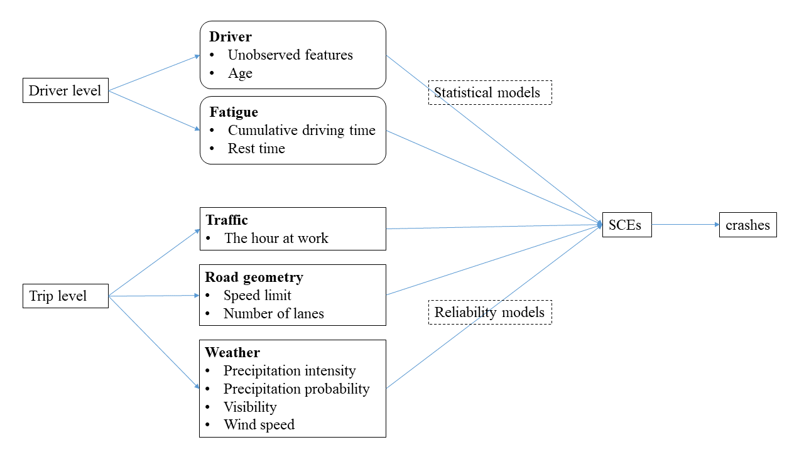

--- 
title: "Modeling Truck Safety Critical Events: Efficient Bayesian Hierarchical Statistical and Reliability Models"
author: "Miao Cai"
date: "`r Sys.Date()`"
output: 
  bookdown::pdf_book:
    template: tex/template_yihui_demo.tex
    latex_engine: xelatex
    citation_package: none
    keep_tex: yes
#    pandoc_args: [ "--csl", "AAP.csl" ]
bibliography: [bib/bib.bib]
csl: [bib/AAP.csl]
#csl: nature.csl
link-citations: yes
site: bookdown::bookdown_site
github-repo: caimiao0714/MiaoPhDDissertation
description: "This is Miao Cai's dissertation."
---
--- 
title: "Modeling Truck Safety Critical Events: Efficient Bayesian Hierarchical Statistical and Reliability Models"
author: "Miao Cai"
date: "`r Sys.Date()`"
output: 
  bookdown::pdf_book:
    template: tex/template_yihui_demo.tex
    latex_engine: xelatex
    citation_package: none
    keep_tex: yes
#    pandoc_args: [ "--csl", "AAP.csl" ]
bibliography: [bib/bib.bib]
csl: [bib/AAP.csl]
#csl: nature.csl
link-citations: yes
site: bookdown::bookdown_site
github-repo: caimiao0714/MiaoPhDDissertation
description: "This is Miao Cai's dissertation."
---

```{r setup, include=FALSE}
knitr::opts_chunk$set(echo = TRUE, 
                      fig.align = "center", 
                      out.width="\\linewidth",
                      fig.pos = 'ht',
                      cache = FALSE)
```


<!--chapter:end:index.Rmd-->

---
title: An Example R Markdown Document
subtitle: (A Subtitle Would Go Here if This Were a Class)
author: Miao Cai
institute: Department of Epidemiology and Biostatistics
# date: "`r Sys.Date()`"
titlegraphic: './logos/SLU-CPHSJ-left.png'
fontsize: 10pt
output:
 beamer_presentation:
    template: tex/Beamer_Miao_template.tex
    keep_tex: false
    latex_engine: xelatex # pdflatex also works here
    dev: cairo_pdf # I typically comment this out  if latex_engine: pdflatex
    slide_level: 3
make149: true
mainfont: "Open Sans" # Try out some font options if xelatex
titlefont: "Titillium Web" # Try out some font options if xelatex
---

```{r setup, include=FALSE, cache=F, message=F, warning=F, results="hide"}
knitr::opts_chunk$set(cache=FALSE,
                      out.width='80%',
                      out.height='80%',
                      out.extra='keepaspectratio')
#knitr::opts_chunk$set(fig.path='figs/')
```


Introduction
============

### Caribbean Queen and Operation Urgent Fury

Billy Ocean released "Caribbean Queen" in 1984.

- Emphasized sharing the same dream
- Hearts beating as one

"Caribbean Queen" is about the poor execution of Operation Urgent Fury.

- Echoed JCS chairman David Jones' frustrations with military establishment.

Billy Ocean is advocating for what became the Goldwater-Nichols Act.

- Wanted to take advantage of **economies of scale**, resolve **coordination problems** in U.S. military.

### The Good Day Hypothesis

We know the following about Ice Cube's day.

1. The Lakers beat the Supersonics.
2. No helicopter looked for a murder.
3. Consumed Fatburger at 2 a.m.
4. Goodyear blimp: "Ice Cube's a pimp."

### The Good Day Hypothesis

This leads to two different hypotheses:

- $H_0$: Ice Cube's day is statistically indistinguishable from a typical day.
- $H_1$: Ice Cube is having a good (i.e. greater than average) day.

These hypotheses are tested using archival data of Ice Cube's life.

Methods
=======

### LaTex Equations

The likelihood function of a non-homogeneous Poisson process (NHPP) with a power law process (PLP) intensity function is:

\begin{equation}\label{eq:pdftau}
\begin{aligned}
f(n, t_1, t_2, \cdots, t_n) & = f(n)f(t_1, t_2, \cdots, t_n|n)\\
& = \frac{e^{-\int_0^\tau \lambda(u)du}[\int_0^\tau \lambda(u)du]^n}{n!}n!\frac{\prod_{i=1}^n\lambda(t_i)}{[\Lambda(\tau)]^n}\\
& = \Big(\prod_{i=1}^n\lambda(t_i) \Big)e^{-\int_0^\tau \lambda(u)du}\\
& = \Big(\prod_{i=1}^n\frac{\beta}{\theta}(\frac{t_i}{\theta})^{\beta - 1} \Big)e^{-(\tau/\theta)^\beta},\\ 
n & = 0, 1, 2, \cdots, \quad  0 < t_1 < t_2 < \cdots < t_n
\end{aligned}
\end{equation}

Results
=======

### Include figures

```{r jplp, fig.cap='The intensity function, SCEs, and rests of a jump-point PLP',echo=FALSE}
knitr::include_graphics("figs/PLP-jump-point-intensity.pdf")
```

### A Total Conflict Game Between Sheena Easton and Her Baby

|                        | XX            | YY            |
|------------------------|---------------|---------------|
| **Baby Home Again**    |  -100, **100**| **100**, 0    |
| **Baby Stays at Work** |   **50**, 0   | -100, **100** |

Sheena Easton and her baby are playing a **zero-sum (total conflict) game**.

- Akin to Holmes-Moriarty game (see: von Neumann and Morgenstern)
- Solution: **mixed strategy**


Conclusion
==========

### Python

Wonderful Python packages are available:

- `pandas`, 
- `numpy`, 
- `sci-kit`, 
- $\cdots$
- `keras`

### R

Wonderful R packages are available:

- `tidyverse`
- `data.table`
- `caret`

### The best language

> PHP is the best language.

<!--chapter:end:Beamer_Miao_example.Rmd-->

<!--
Dedication {-}
==========

I dedicate this dissertation to my parents, Zhimin Cai (蔡致民) and Guizhen Xu (徐桂珍), who believe in the power of higher education, hard work, and always support me.

Acknowledgement {-}
===============

I want to thank my PhD mentor and committee chair Dr. Steven E. Rigdon, committee members Dr. Hong Xian and Dr. Fadel Megahed.
-->

\linespread{1}
\cleardoublepage
\tableofcontents

\listoffigures
\listoftables


\mainmatter
\doublespacing

<!--
\doublespacing
\singlespacing

__>

<!--chapter:end:chapters//00-dedication.Rmd-->


<!--chapter:end:chapters//01-intro.Rmd-->


### Fatigue
### Driver characteristics
### Traffic
### Weather
### Road characteristics

<!--chapter:end:chapters//02a-lit-truck.Rmd-->


### Overview
### Bayesian models
### Hierarchical models
### Markov chain Monte Carlo (MCMC)
### Hamiltonian Monte Carlo (HMC)
### Subsampling MCMC

<!--chapter:end:chapters//02b-lit-predictive.Rmd-->

Conceptual framework
--------------------

The conceptual model in this study is based on three frameworks:

1. *Truck Driver Fatigue Model* by @crum2002influence, 
2. *$5 \times$ST-level hierarchy theory* in traffic safety by @huang2010multilevel, 
3. *Commercial motor vehicle driver fatigue framework* by @stern2019data.

Summarized from literature review and focus groups, the *Truck Driver Fatigue Model* includes three general categories of factors to driver fatigue, and each category includes several comparatively specific constructs: truck driving environment (regularity of time, quality of rest, and trip control), economic pressure (scheduling demands of commerce, driver internal economic or personal factors, and carrier economic factors), and organizational carrier support (operational practices and general safety measures) [@crum2002influence]. @huang2010multilevel proposed a 5-level hierarchy theory in studying traffic safety: geographic region, traffic site, traffic crash, driver-vehicle unit, and occupant. The framework proposed in @stern2019data listed four predictor domains including driver, vehicle, carrier, and environment, as well as five outcome variables, crash rate, serious crash rate, fatal crash rate, safety critical event rate, and fatigue.

Figure \@ref(fig:conceptmodel) demonstrates the conceptual framework used in this study. A two-level hierarchy structure is proposed in this study, driver level and trip level. Driver level factors include driver features and fatigue; trip level factors include traffic, road geometry, and weather. These factors are assumed to be directly associated with SCEs, which can be modeled by statistical and reliability models. Final, the SCEs are hypothesized to be directly associated with crashes.

```{r conceptmodel, fig.cap='Conceptual model. SCEs represent safety critical events.', echo=FALSE, eval=TRUE}

```


<!--chapter:end:chapters//02c-Conceptual.Rmd-->

RESEARCH AIMS
=============

The overarching goal of this proposed dissertation is to construct scalable Bayesian hierarchical models for NDS data and understand how cumulative driving time and other factors will impact the performance of truck drivers. However, there are several gaps in traffic safety studies based on the previous literature review. First, an increasing number of studies are using SCEs as the outcome variable, but *the association between crashes and SCEs has not been confirmed among truck drivers*. Second, SCEs are much more common and there can be multiple SCEs within a short period, but *recurrent events models were not widely applied* to understand the risk factors for SCEs. Third, *the high-resolutional and high-dimensional data collected by NDS poses a challenge to Bayesian estimation*. Considering these limitations, the aims of this research will focus on developing innovative and scalable Bayesian hierarchical statistical and reliability models to understand NDS data. Accordingly, the specific aims of this dissertation are as follows:

1. **Aim1: To examine the association between truck crashes and SCEs using a Bayesian Gamma-Poisson regression**. I hypothesize that the rate of crashes is positively associated with the rate of SCEs among truck drivers controlling for the miles driven and other covariates.

2. **Aim2: To construct three scalable Bayesian hierarchical models to identify  potential risk factors for SCEs**. I hypothesize that the patterns of SCEs vary significantly from drivers to drivers and can be predicted using risk factors including cumulative driving time, weather, road geometry, age, speed, speed variation, and others.
    + **Sub-aim 1: to contruct a Bayesian hierarchical logistic regression to model the probability of SCEs in 30-minute intervals**. I hypothesize that the probability of SCEs is positively associated with the cumulative driving time and risk factors, and it varies significantly from drivers to drivers.
    + **Sub-aim 2: to contruct a Bayesian hierarchical Poisson regression to model the rate of SCEs in 30-minute intervals**. I hypothesize that the rate of SCEs is positively associated with the cumulative driving time and risk factors, and it varies significantly from drivers to drivers.
    + **Sub-aim 3: to contruct a Bayesian hierarchical non-homogeneous Poisson process with the power law process intensity function to model the intensity change of SCEs within each shift**. I hypothesize that the intensity of SCEs increases in later stage of shifts, can be predicted by the risk factors, and varies from drivers to drivers.

3. **Aim3: To propose an innovative reliability model that accounts for both within shift cumulative driving time and between-trip rest time**. I hypothesize that the intensity function can be recovered by some proportion or by some amounts during rests between trips, and intensity function varies significantly from drivers to drivers.


<!--
- A focus on crashes instead of precursors of crashes
- A focus on road segments rather than drivers
- A focus on case-control comparison given the rareness of truck crashes rather than rates
- A focus on small-scale data
-->

<!--chapter:end:chapters//02d-Aims.Rmd-->


### Real-time ping
### Truck crashes and SCEs
### Driver demographics
### Weather data from the `Dark Sky API`
### Road geometry data from the `OpenStreetMap`
### Shifts
### Trips
### 30-minute intervals

<!--chapter:end:chapters//03a-Data.Rmd-->


<!--chapter:end:chapters//03b-Plan1.Rmd-->


### Bayesian hierarchical logistic regression {#hierarchical-logit}
### Bayesian hierarchical Poisson regression
### Non-homogeneous Poisson process (NHPP)

<!--chapter:end:chapters//03b-Plan2.Rmd-->


<!--chapter:end:chapters//03b-Plan3.Rmd-->


# THE PROBABLE CONTENT

Placeholder


<!--chapter:end:chapters//03c-Content.Rmd-->

<!-- This part should not be included in prospectus for oral exam

# TRUCK CRASHES AND CRITICAL EVENTS

-->

<!--chapter:end:chapters//04-aim1.Rmd-->

<!--
# THREE MODELS

## Hierarchical logistic model

### Model set up


### Bayesian estimation based on simulated data


## Hierarchical Poisson model


## Hierarchical power law process


### Bayesian estimation based on simulated data

-->

<!--chapter:end:chapters//05-aim2.Rmd-->

<!--
# JUMP-POINT PLP

@black1996statistical gives an alternative plan for achieving Aim 3.


<!--
- Comparison with results given by frequentist models using REML (`lmer4`)
- Comparison with results given by Bayesian models using HMC (`rstan`)
- Comparison with results given Bayesian models using INLA (`INLA`)
-->

<!--chapter:end:chapters//06-aim3.Rmd-->

<!--
# DISCUSSION

-->

<!--chapter:end:chapters//07-discussion.Rmd-->


<!--chapter:end:chapters//90-Appendix.Rmd-->

<!--
Bibliography {-}
============
-->

```{=latex}
\linespread{0.5}

\chapter*{\markboth{BIBLIOGRAPHY}{BIBLIOGRAPHY}{BIBLIOGRAPHY}}
\addcontentsline{toc}{chapter}{BIBLIOGRAPHY}

\everypar{\hangafter=1 \setlength{\hangindent}{3em}}{\par}
\setlength\parskip{0.3em}
\setlength\parindent{0pt}
```


<div id="refs"></div>


<!--chapter:end:chapters//99-References.Rmd-->

<!--
Vita Auctoris {-}
=============
-->

<!--
```{=latex}
\chapter*{\markboth{Vita Auctoris}{Vita Auctoris}{Vita Auctoris}}
\addcontentsline{toc}{chapter}{Vita Auctoris}
```

\doublespacing

Miao Cai was born and raised in Xinzhou district, Wuhan, Hubei Province, China. 

-->

<!--chapter:end:chapters//991-Vita_Auctoris.Rmd-->

